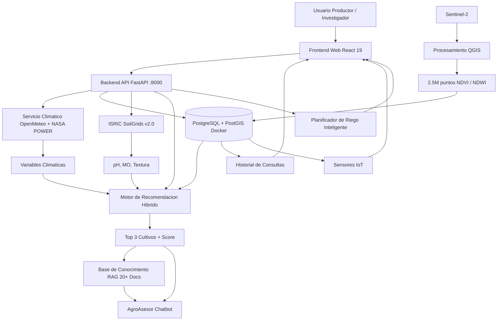

# Vision General del Sistema

## Diagrama de Bloques



## Stack Tecnologico

| Capa | Tecnologia | Version |
|------|-----------|---------|
| Frontend | React + Vite + Tailwind + Zustand | 19 / 8 / 3.4 / 5 |
| Backend | FastAPI + SQLAlchemy + asyncpg | 0.115+ / 2.0+ / 0.30+ |
| Base de datos | PostgreSQL + PostGIS (Docker local) | 17 / 3.4 |
| Contenedores | Docker + Docker Compose | 27+ / 2.30+ |
| ML | scikit-learn RF + LSTM | 1.6+ |
| Agente IA | LangChain + LangGraph + RAG TF-IDF + Ollama | 0.3+ |
| Datos satelitales | Sentinel-2 (ESA) via QGIS | — |
| Datos climaticos | NASA POWER + OpenMeteo | — |
| Datos de suelo | ISRIC SoilGrids v2.0 | REST API |
| Mapas | Leaflet + react-leaflet + leaflet-draw | 1.9 / 5.0 / 1.0 |

## Flujo de Procesamiento

```
Usuario selecciona parcela en el mapa (clic o dibujo)
    ↓
GET /soil/data?lat=X&lng=Y → ISRIC SoilGrids → pH, MO, textura (autocompleta)
    ↓
Usuario ajusta parametros y hace submit
    ↓
POST /analyze-location con coordenadas + datos de suelo
    ↓
Backend:
1. POST /geo/decode → PostGIS ST_Contains → municipio
2. climate_service.get_climate_data() → OpenMeteo
3. satellite_service.get_satellite_data() → Nearest NDVI (ST_Distance)
4. recommendation.generate_recommendations()
   → CropClassifier heuristico + RF inference (con fallback)
5. Guarda analisis en DB
6. Retorna JSON: clima, satelite, top 3 cultivos
    ↓
Frontend muestra resultados en /resultado (AnalysisResults)
    ↓
Usuario puede:
  - Ver detalle por factor
  - Comparar cultivos
  - Exportar reporte
  - Preguntar al AgroAsesor
  - Ir a IA Predictiva para proyeccion de 6 meses
```

## Flujos Detallados

### Flujo de un analisis tipico

```
Usuario completa formulario en AnalisisCultivos
  → departamento, municipio, lat, lng, tipo_suelo, mes_siembra, area_hectareas, ph, MO, textura
  (pH, MO y textura se autocompletan via SoilGrids al hacer clic en el mapa)
  ↓
useAnalisisCultivos.handleSubmit()
  ↓
AnalysisService.performAnalysis(formulario)
  ↓
POST /analyze-location (JSON body)
  ↓
Backend:
1. climate_service.get_climate_data() → OpenMeteo API
2. satellite_service.get_satellite_data() → nearest NDVI from PostgreSQL
3. inference.predict_crop_recommendations() → RF + fallback heuristico
4. Guardar en analisis (datos_formulario JSONB + resultado_completo JSONB)
5. Retornar AnalyzeResponse
  ↓
Frontend recibe datos → Zustand setResultado() → agrega al historial
  ↓
Navega a /resultado → AnalysisResults muestra reporte
```

### Flujo AgroAsesor (Chat + RAG + LangChain + Ollama)

```
Usuario escribe "como controlo el gusano cogollero en maiz?"
  ↓
POST /chat {"message": "como controlo el gusano cogollero en maiz?"}
  ↓
chat_service.process_chat_message()
  ↓
1. Guardar mensaje en conversaciones + mensajes
2. Buscar intencion:
   - Keywords: "maiz", "gusano", "cogollero", "plaga"
   - Coincide con: plagas-enfermedades (17 intenciones total)
3. search_rag(query, k=3):
   - Keyword scoring sobre 20+ docs de backend/app/data/rag/
   - Retorna chunks del doc de plagas + maiz
4. _gather_db_context():
   - Ultimo analisis del usuario
   - Estado de sensores
5. Si hay OPENAI_API_KEY o OLLAMA_BASE_URL:
   - LLM genera respuesta con contexto RAG + DB
6. Si no:
   - Formatear respuesta con RAG context + DB context template
7. Guardar mensaje IA en mensajes
8. Retornar respuesta
```

### Flujo IA Predictiva (Proyeccion 6 meses)

```
Usuario va a IA Predictiva
  ↓
usePrediccion.js carga coordenadas (manualmente o desde GET /history)
  ↓
Usuario selecciona analisis del historial o ingresa coordenadas manuales
  ↓
Usuario ajusta sliders de fertilizacion (NPK) y riego
  ↓
Clic en "Generar Proyeccion"
  ↓
POST /predict {"lat", "lng", "analysis_id", "meses": 3, "npk_override", "riego_override"}
  ↓
prediction_service.project_window()
  ↓
1. fetch_nasa_climatology(lat, lng) → NASA POWER (promedios historicos mensuales)
2. fetch_current_climate(lat, lng) → OpenMeteo
3. Anomalia: current - historical mean
4. Si analysis_id: resolver datos heredados (cultivo, pH, MO, textura)
5. Para cada mes (proximos 6):
   a. Proyectar clima: historical_month + anomaly * decay_factor(exp(-0.3*i))
   b. Aplicar NPK_override y riego_override como factores de ajuste
   c. score_with_factors() → incorpora temp, humedad, precip, pH, MO, textura, NDVI, NPK, riego
   d. Detectar riesgo de enfermedades (Roya si humedad > 80% y temp 20-25°C)
6. Identificar mejor mes, mejor cultivo, ventana optima de siembra
  ↓
Response: meses[], factor_weights[], alertas_globales[], best_window{}
  ↓
Frontend renderiza:
  - MonthlyProjectionGrid: grid 6 meses con stats climaticos + cultivos
  - FeatureChart: factores de influencia (barras)
  - SimulationSection: riesgo de inundacion/sequia/rayos/Niño
  - ClimateRiskPanel: alertas climaticas
  - MitigationActions: acciones de mitigacion sugeridas
```

### Flujo SoilGrids (Datos de Suelo Automaticos)

```
Usuario hace clic en el mapa (MapSelector) o dibuja un area
  ↓
handleMapChange() en useAnalisisCultivos.js
  ↓
GET /soil/data?lat=10.33&lng=-75.41
  ↓
soil_service.get_soil_data()
  → POST rest.isric.org/soilgrids/v2.0/properties/query
  → phh2o, soc, sand, silt, clay
  → ph directo, MO = SOC * 1.724 / 10, textura = triangulo USDA
  ↓
Response: { ph, materia_organica, textura_suelo, fuente }
  ↓
actualizarFormulario() → toast informativo "Datos de suelo cargados"
  ↓
Usuario puede sobrescribir manualmente los valores
```

### Flujo Motor Hibrido (Random Forest + Heuristico)

```
recommendation.generate_recommendations()
  ↓
inference.predict_crop_recommendations()
  ↓
1. Cargar modelo RF (crop_model_rf.joblib + crop_scaler.joblib)
2. Si modelo existe:
   - RF.predict_proba() → probabilidades por cultivo
   - score = int(prob * 100)
   - metodo = "random_forest", probabilidad = prob
3. Si modelo no existe o falla:
   - Fallback a CropClassifier.score() (reglas heuristicas)
   - metodo = "heuristico", probabilidad = null
  ↓
Enriquecer con metadatos del CSV (emoji, ciclo, rendimiento)
  ↓
Retornar top 3 + metodo usado
```

### Flujo Plan de Riego Inteligente

```
Usuario va a SensoresIoT → panel de riego
  ↓
Selecciona sensor/cultivo o ingresa datos manualmente
  ↓
POST /irrigation-plans {"sensor_id", "cultivo", "area_hectareas"}
  ↓
irrigation_service.generate_irrigation_plan()
  ↓
1. Obtener datos climaticos actuales (OpenMeteo)
2. Calcular ET0 (Penman-Monteith simplificado)
3. Obtener textura de suelo (SoilGrids o manual)
4. Calcular balance hidrico: lluvia - ET0
5. Generar programacion: frecuencia, volumen, duracion
6. Aplicar umbrales especificos por cultivo
  ↓
Response: plan_riego con schedule semanal + volumen total
  ↓
Frontend muestra plan con opcion de exportar a tareas
```

## Pagina de Ajustes

La pagina `/investigador/ajustes` permite:

| Seccion | Accion | Storage |
|---------|--------|---------|
| Mi Finca | Guardar coordenadas default | localStorage (agrocaribe_finca) |
| Servidor API | Cambiar URL del backend | localStorage (agrocaribe_api_url) |
| Datos | Exportar / Importar JSON | localStorage completo |
| Sistema | Limpiar cache + reiniciar | localStorage (prefijo agrocaribe_) |

Los mapas y formularios usan `getSetting('finca')` para las coordenadas default.
La URL del backend se lee desde localStorage en `api.js` al importar el modulo.

> **Nota:** Ya no existe MOCK_DATA. Cuando el backend no responde, `analysisService.js` tiene un fallback minimo de 3 cultivos estaticos para evitar pantallas en blanco.

---

## Referencias

- [[03-architecture/modulo-clima]] — Clima: NASA POWER + OpenMeteo
- [[03-architecture/modulo-satelital]] — Satelital: QGIS + Sentinel-2 + NDVI
- [[03-architecture/modulo-recomendacion]] — Motor hibrido de recomendacion
- [[03-architecture/modulo-suelo-soilgrids]] — Datos de suelo automaticos
- [[05-database/arquitectura-db]] — Base de datos: esquema, PostGIS
- [[07-deployment/despliegue]] — Docker + Vercel deploy
- [[06-api/endpoints]] — Documentacion de endpoints del backend
- [[03-architecture/arquitectura-frontend]] — Documentacion del frontend
