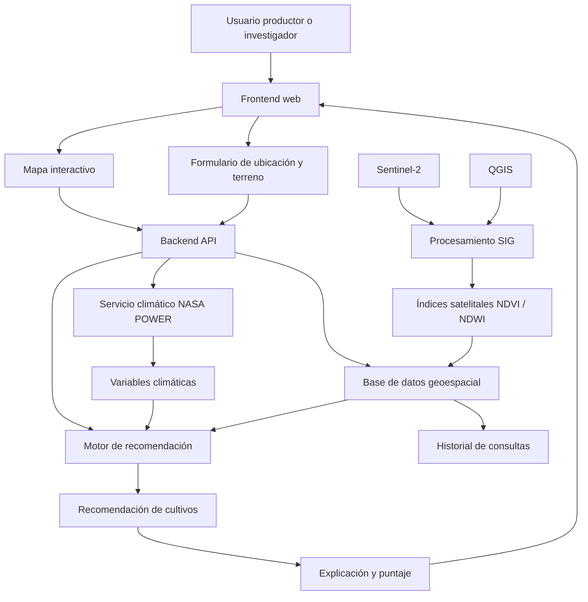

# AgroCaribe IA: Sistema Inteligente de Recomendación de Cultivos

## 1. Introducción
AgroCaribe IA es una plataforma tecnológica de vanguardia diseñada para optimizar la productividad agrícola mediante el uso de inteligencia artificial. El sistema procesa variables climáticas y características del suelo para ofrecer recomendaciones precisas sobre los cultivos más aptos para cada parcela, permitiendo a los agricultores tomar decisiones basadas en datos.

---

## 2. Arquitectura del Sistema

### 2.1 Flujo de Trabajo (Flowchart)


### 2.2 Diseño Funcional
1.  **Usuario (Productor / Investigador):** Punto de entrada al sistema.
2.  **Frontend Web (Mapa + Formulario):** Interfaz para delimitar zonas y capturar datos de terreno.
3.  **Backend API:** Orquestador de solicitudes y servicios.
4.  **Motor de Recomendación:** IA o reglas agronómicas para procesar datos.
5.  **Base de Datos:** Almacena clima, suelo, índices y zonas geográficas.
6.  **Fuentes Externas:** Integración con NASA POWER (clima) y Sentinel-2 (satelital).

---

## 3. Herramientas y Fuentes de Datos

### 3.1 QGIS
Utilizado para:
*   Delimitación de zonas de estudio.
*   Cálculo y validación de índices NDVI.
*   Exportación de capas en formatos GeoJSON, SHP o GeoPackage.
*   Preparación de cartografía para informes.

### 3.2 Sentinel-2 (Análisis Satelital)
Provee información visual y multiespectral del territorio:
*   **NDVI (Índice de Vegetación de Diferencia Normalizada):** `(B08 - B04) / (B08 + B04)`. Indica el vigor de la vegetación.
*   **NDWI (Índice de Agua de Diferencia Normalizada):** Identifica humedad o agua superficial.

### 3.3 NASA POWER (Datos Climáticos)
Fuente principal para variables atmosféricas:
*   Precipitación y Humedad relativa.
*   Temperatura mínima y máxima.
*   Radiación solar y Velocidad del viento.

---

## 4. Módulos del Sistema

### Módulo 1: Selección de Zona
El usuario selecciona el departamento, municipio o punto exacto en el mapa interactivo.
*   **Salida:** Coordenadas (Lat, Lon) o polígono de análisis.

### Módulo 2: Consulta Climática
El backend utiliza la ubicación para consultar NASA POWER en un rango de fechas específico.
*   **Salida:** JSON con promedios de temperatura, lluvia, humedad y radiación.

### Módulo 3: Análisis Satelital (Enfoque Híbrido)
*   **Versión Implementada:** Procesamiento previo en QGIS → Almacenamiento de índices NDVI por zona en la base de datos geoespacial.

### Módulo 4: Motor de Recomendación
Corazón del sistema que utiliza un **modelo híbrido**:
1.  **Reglas Agronómicas:** Validación de rangos óptimos para cultivos específicos (ej. Maíz: 24-30°C).
2.  **Scoring & IA (Random Forest):** 
    *   **Sinopsis:** Se utiliza el algoritmo de **Random Forest** (Bosques Aleatorios) para la clasificación de aptitud. Este modelo combina múltiples árboles de decisión para reducir el riesgo de sobreajuste y proporcionar una "Importancia de Variables", permitiendo identificar si el clima o el suelo están afectando más la recomendación.
    *   **Estado en Prototipado:** En la fase actual de **Prototipo (MVP)**, la lógica del modelo está *simulada* mediante funciones de puntuación estáticas (mock data) para validar la experiencia de usuario. La integración del modelo entrenado con datos reales se realizará en la **Fase 2**.


---

## 5. Implementación del Desarrollo

### 5.1 Estructura del Backend (Sugerida)
```text
agro-recommender-api/
├── app/
│   ├── main.py
│   ├── climate_service.py
│   ├── satellite_service.py
│   ├── recommendation_engine.py
│   ├── database.py
│   ├── schemas.py
│   └── config.py
├── data/
│   ├── crops_requirements.csv
│   ├── municipalities.geojson
│   └── app.db
└── requirements.txt
```

### 5.2 Endpoints Principales
*   `POST /analyze-location`: Recibe coordenadas y datos de suelo; devuelve análisis completo.
*   `GET /climate`: Consulta datos climáticos históricos.
*   `GET /satellite-indicators`: Obtiene índices NDVI de la zona.
*   `POST /recommend`: Ejecuta el motor de IA para sugerir cultivos.

---

## 6. Hoja de Ruta (Roadmap MVP)
1.  **MVP Funcional (Fase 1):** Selección de municipio → Consulta NASA POWER → Carga de NDVI pre-procesado → Recomendación por reglas básicas y lógica mock de IA.
2.  **Fase 2 (IA Integrada):** Entrenamiento e integración del modelo **Random Forest** con datasets históricos regionales.
3.  **Fase 3:** Mapas de calor de rendimiento e historial de consultas persistente.
4.  **Fase 4:** Descarga de reportes técnicos en PDF.
