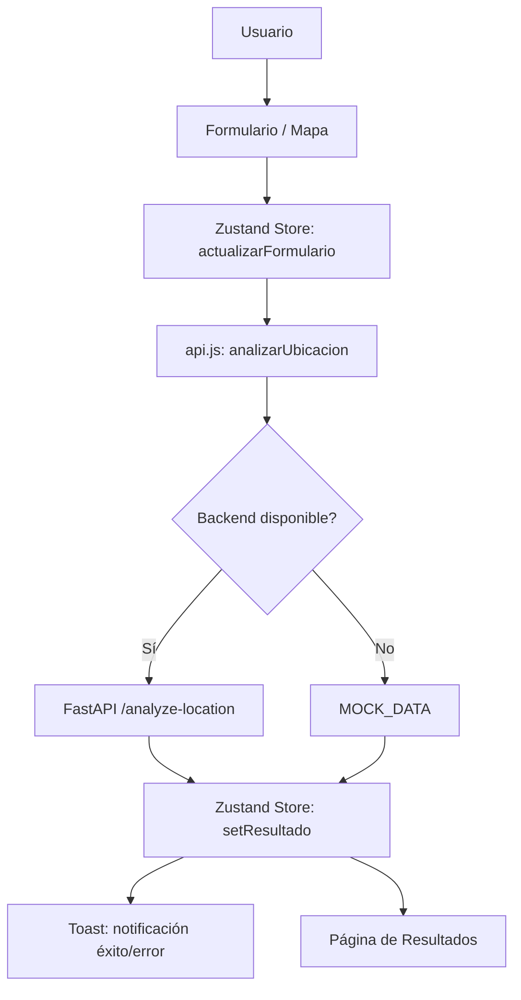

# Arquitectura del Sistema

## Capas de la Aplicación

El frontend sigue un patrón modular con cuatro capas bien diferenciadas:

```
Presentación (Components/Pages)
       ↓
  Estado (Zustand Store)
       ↓
  Servicios (API + Mock)
       ↓
  Navegación (React Router)
```

### 1. Capa de Presentación
Componentes JSX + Tailwind CSS en `src/components/` y `src/pages/`. Diseño glassmorphism con backdrop-filter.

### 2. Capa de Estado
Store centralizado en `src/context/useAppStore.js` con Zustand. Maneja formulario, resultados, estado de carga y notificaciones Toast.

### 3. Capa de Servicios
Abstracción de llamadas API en `src/services/api.js` con estrategia Mock Fallback: si el backend no responde, retorna datos simulados.

### 4. Capa de Navegación
React Router 6 en `src/App.jsx` con layouts diferenciados (LayoutApp para público, ResearcherLayout para investigador).

## Flujo de Datos



## Ciclo de Análisis

1. **Captura:** Usuario completa formulario o selecciona ubicación en el mapa
2. **Actualización:** Componentes llaman a `actualizarFormulario` en el store
3. **Ejecución:** Se invoca `analizarUbicacion` (service), activando `cargandoAnalisis`
4. **Sincronización:** Al recibir respuesta, se actualiza `resultado` y se muestra Toast
5. **Consumo:** Páginas como Resultado o IAPredictiva se suscriben al store

## Decisiones Técnicas

- **Zustand sobre Context API:** Evita renders innecesarios y providers anidados
- **Mock Fallback:** Desarrollo serverless sin depender del backend
- **CSS Modules + Tailwind:** Componentes complejos usan `.module.css` para evitar colisiones; el resto usa utilidades Tailwind
- **SessionStorage:** Sesión se limpia al cerrar la pestaña (login de investigador)
- **Framer Motion:** Solo en ResearcherLayout para animaciones de dropdown
