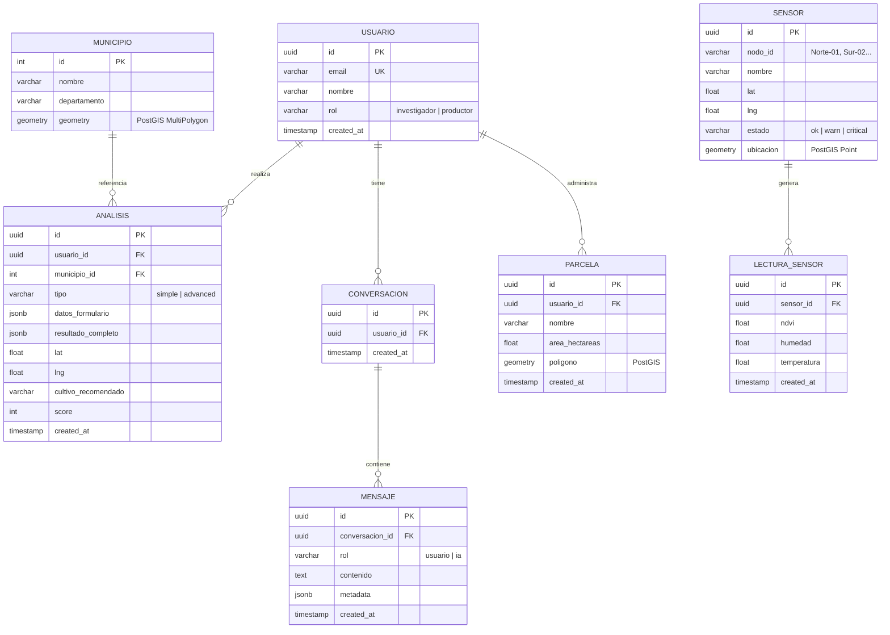
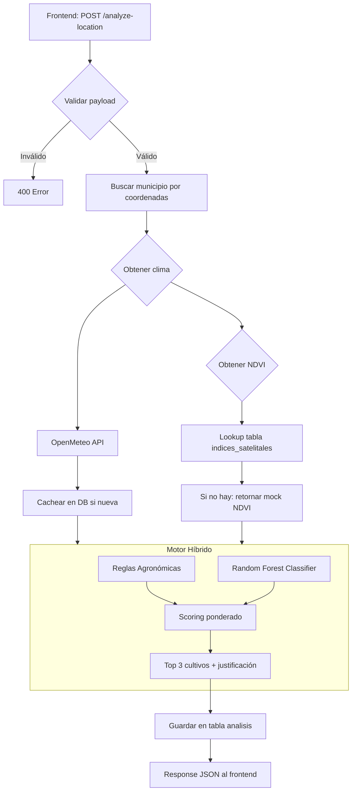
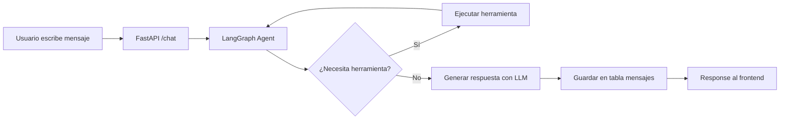

# Arquitectura del Backend

## 1. Technology Stack

| Componente | Tecnología | Versión | Propósito |
|------------|-----------|---------|-----------|
| Framework API | FastAPI | 0.115+ | Framework REST asíncrono con validación Pydantic y OpenAPI automático |
| Base de datos | PostgreSQL | 16 | Datos relacionales: análisis, usuarios, parcelas, historial |
| Extensión espacial | PostGIS | 3.4 | Consultas geoespaciales (coordenadas, polígonos, NDVI) |
| ORM | SQLAlchemy | 2.0+ | Mapeo objeto-relacional con soporte async vía asyncpg |
| Cliente DB asíncrono | asyncpg | 0.30+ | Conexión nativa PostgreSQL desde FastAPI asíncrono |
| Chatbot | LangGraph | 0.3+ | Agente conversacional con estado, herramientas y persistencia |
| Modelo ML | scikit-learn (Random Forest) | 1.6+ | Clasificación de aptitud de cultivos |
| Contenedores | Docker + Docker Compose | 27+ / 2.30+ | Orquestación multi-servicio para desarrollo y despliegue |
| Proxy inverso | Nginx | 1.27 | Servir frontend build + enrutar `/api/*` al backend |

### Justificación de elecciones

- **FastAPI** sobre Flask: rendimiento async superior, validación automática con Pydantic, documentación OpenAPI interactiva (útil para debuguear el frontend)
- **PostGIS** desde el día 1: el frontend trabaja con coordenadas Leaflet, parcelas con geometría y consultas espaciales como "sensores dentro de un radio"
- **LangGraph** sobre LangChain simple: porque el chatbot necesita estado multi-turno, herramientas (consultar DB, clima, sensores) y branching condicional
- **asyncpg** sobre psycopg2: FastAPI es async, asyncpg evita el overhead de thread pool

---

## 2. Estructura del Proyecto

```
backend/
├── app/
│   ├── __init__.py
│   ├── main.py                    # FastAPI app, CORS, lifespan, router mounts
│   │
│   ├── core/
│   │   ├── __init__.py
│   │   ├── config.py              # Settings via pydantic-settings (env vars)
│   │   ├── database.py            # AsyncEngine, session factory
│   │   └── dependencies.py        # Dependency injection (get_db, get_current_user)
│   │
│   ├── models/
│   │   ├── __init__.py
│   │   ├── municipio.py           # Municipios table + geometry (PostGIS)
│   │   ├── analisis.py            # Analysis records
│   │   ├── parcela.py             # Parcelas with geometry
│   │   ├── sensor.py              # IoT sensor nodes
│   │   ├── lectura_sensor.py      # Time-series sensor readings
│   │   ├── usuario.py             # Users (investigadores/productores)
│   │   ├── conversacion.py        # Chat conversations
│   │   └── mensaje.py             # Chat messages
│   │
│   ├── schemas/
│   │   ├── __init__.py
│   │   ├── analisis.py            # Pydantic models for /analyze-location
│   │   ├── clima.py               # Climate request/response models
│   │   ├── satelite.py            # Satellite indicator models
│   │   └── chat.py                # Chat request/response models
│   │
│   ├── api/
│   │   ├── __init__.py
│   │   ├── router.py              # Main router aggregator
│   │   ├── analisis.py            # POST /analyze-location
│   │   ├── clima.py               # GET /climate
│   │   ├── satelite.py            # GET /satellite-indicators
│   │   ├── municipios.py          # GET /municipalities
│   │   └── historial.py           # GET /history
│   │
│   ├── services/
│   │   ├── __init__.py
│   │   ├── climate_service.py     # OpenMeteo API client
│   │   ├── satellite_service.py   # NDVI lookups from DB
│   │   ├── recommendation.py      # Hybrid engine: rules + Random Forest
│   │   └── chat_service.py        # LangGraph agent orchestration
│   │
│   ├── ml/
│   │   ├── __init__.py
│   │   ├── model.py               # Random Forest model wrapper
│   │   ├── training.py            # Training pipeline
│   │   └── crops_requirements.csv # Crop optimal ranges (pH, temp, etc.)
│   │
│   └── agent/
│       ├── __init__.py
│       ├── graph.py               # LangGraph state graph definition
│       ├── tools.py               # Agent tools (query_db, get_climate, etc.)
│       └── state.py               # GraphState typed dict
│
├── data/
│   ├── migrations/                # Alembic migration scripts
│   ├── seeds/                     # Seed data (municipios, crops)
│   └── ndvi/                      # Pre-processed NDVI GeoJSON files
│
├── tests/
│   ├── test_analisis.py
│   ├── test_clima.py
│   ├── test_satelite.py
│   └── test_chat.py
│
├── alembic.ini
├── Dockerfile
├── requirements.txt
└── .env.example
```

---

## 3. Base de Datos

### 3.1 Esquema Relacional



### 3.2 Notas del esquema

- **PostGIS** habilita `geometry` types. Los municipios usarán `MultiPolygon` para permitir consultas "qué municipio contiene este punto"
- **JSONB** en `analisis.datos_formulario` y `analisis.resultado_completo` para flexibilidad: cada tipo de análisis (simple/advanced) tiene campos distintos
- Las lecturas de sensores son **time-series**. Para alto volumen futuro considerar TimescaleDB
- LangGraph usa la tabla `conversaciones`/`mensajes` como **checkpointer** para persistir el estado del agente entre turns

### 3.3 Seed Data Inicial

```sql
-- Municipios del Caribe colombiano con geometría PostGIS
INSERT INTO municipios (nombre, departamento, geometry) VALUES
  ('Barranquilla', 'Atlántico', ST_GeomFromGeoJSON('...')),
  ('Soledad', 'Atlántico', ST_GeomFromGeoJSON('...')),
  ('Cartagena', 'Bolívar', ST_GeomFromGeoJSON('...')),
  ('Santa Marta', 'Magdalena', ST_GeomFromGeoJSON('...')),
  ('Montería', 'Córdoba', ST_GeomFromGeoJSON('...')),
  ('Valledupar', 'Cesar', ST_GeomFromGeoJSON('...')),
  ('Sincelejo', 'Sucre', ST_GeomFromGeoJSON('...')),
  ('Riohacha', 'La Guajira', ST_GeomFromGeoJSON('...'));

-- Sensores IoT
INSERT INTO sensores (nodo_id, nombre, lat, lng, estado, ubicacion) VALUES
  ('Norte-01', 'Nodo Norte', 10.50, -74.80, 'ok', ST_SetSRID(ST_MakePoint(-74.80, 10.50), 4326)),
  ('Sur-02', 'Nodo Sur', 10.48, -74.78, 'warn', ST_SetSRID(ST_MakePoint(-74.78, 10.48), 4326)),
  ('Este-03', 'Nodo Este', 10.52, -74.75, 'critical', ST_SetSRID(ST_MakePoint(-74.75, 10.52), 4326));
```

---

## 4. API Endpoints

### 4.1 Contrato Completo

| Método | Ruta | Request | Response | Estado en Frontend |
|--------|------|---------|----------|--------------------|
| `GET` | `/municipalities` | — | `Municipio[]` | ✅ `getMunicipios()` en `api.js` |
| `POST` | `/analyze-location` | `AnalyzeRequest` | `AnalyzeResponse` | ✅ `analizarUbicacion()` |
| `GET` | `/climate` | `lat, lng` (query) | `ClimateData` | ✅ `getClima()` |
| `GET` | `/satellite-indicators` | `lat, lng` (query) | `SatelliteData` | ✅ `getIndicadoresSatelite()` |
| `GET` | `/history` | — | `HistorialEntry[]` | ✅ `getHistorial()` |
| `POST` | `/chat` | `ChatRequest` | `ChatResponse` | Pendiente (hoy es mock) |
| `POST` | `/auth/login` | `LoginRequest` | `TokenResponse` | Futuro (hoy sessionStorage) |

### 4.2 Especificación por Endpoint

#### `GET /municipalities`

```json
// Response 200
[
  {
    "id": 1,
    "nombre": "Barranquilla",
    "departamento": "Atlántico",
    "lat": 10.9685,
    "lng": -74.7813
  }
]
```

**Lógica:** SELECT desde tabla `municipios`. Cacheable (los municipios no cambian).

#### `POST /analyze-location`

```json
// Request
{
  "departamento": "Bolívar",
  "municipio": "Turbaco",
  "lat": 10.33,
  "lng": -75.41,
  "tipo_suelo": "Franco-Arcilloso",
  "acceso_riego": true,
  "mes_siembra": "Mayo",
  "area_hectareas": 5.0,
  "ph_suelo": 6.5,
  "materia_organica": 3.2,
  "textura_suelo": "Franco"
}

// Response 200
{
  "clima": {
    "temperatura": 29.1,
    "precipitacion": 74.5,
    "humedad": 77,
    "evapotranspiracion": 5.2,
    "radiacion_solar": 18.4
  },
  "indicadores_satelite": {
    "ndvi": 0.42,
    "ndwi": 0.18,
    "calidad_suelo": "Media-Alta",
    "cobertura_nube": 12
  },
  "recomendaciones": [
    {
      "cultivo": "Maíz",
      "score": 86,
      "riesgo": "medio",
      "justificacion": "Las condiciones de temperatura (29.1°C) y precipitación (74.5 mm) son adecuadas...",
      "emoji": "🌽",
      "ciclo_dias": 90,
      "rendimiento_estimado": "4.2 t/ha"
    }
  ],
  "ubicacion": { "lat": 10.33, "lng": -75.41 },
  "es_mock": false
}
```

**Pipeline interno:**
1. Validar request (Pydantic)
2. Buscar municipio por coordenadas (PostGIS `ST_Contains`)
3. Obtener clima → OpenMeteo API (o caché en DB)
4. Obtener NDVI → lookup pre-procesado en DB
5. Ejecutar motor de recomendación (reglas + Random Forest)
6. Guardar análisis en DB (tabla `analisis`)
7. Retornar respuesta

#### `GET /climate`

```json
// Query: ?lat=10.33&lng=-75.41
// Response 200
{
  "temperatura": 29.1,
  "precipitacion": 74.5,
  "humedad": 77,
  "evapotranspiracion": 5.2,
  "radiacion_solar": 18.4
}
```

**Fuente:** OpenMeteo API (`https://api.open-meteo.com/v1/forecast`). Parámetros: `temperature_2m`, `relative_humidity_2m`, `precipitation`, `shortwave_radiation`.

#### `GET /satellite-indicators`

```json
// Query: ?lat=10.33&lng=-75.41
// Response 200
{
  "ndvi": 0.42,
  "ndwi": 0.18,
  "calidad_suelo": "Media-Alta",
  "cobertura_nube": 12
}
```

**Fuente:** Datos pre-procesados desde Sentinel-2 vía QGIS, almacenados en tabla `indices_satelitales` con geometría PostGIS.

#### `GET /history`

```json
// Response 200
[
  {
    "id": "C-0421",
    "fecha": "2025-04-21T10:30:00Z",
    "municipio": "Montería",
    "departamento": "Córdoba",
    "cultivo": "Maíz",
    "score": 94,
    "tipo": "analisis",
    "estado": "Exitosa",
    "area_hectareas": 5.2,
    "coordenadas": { "lat": 8.7578, "lng": -75.8814 }
  }
]
```

**Lógica:** SELECT desde `analisis` WHERE `usuario_id = ?` ORDER BY `created_at DESC`.

---

## 5. Pipeline de Análisis (Workflow)



### 5.1 Reglas Agronómicas (Filtro inicial)

Validación de rangos óptimos para cada cultivo:

```python
CROP_REQUIREMENTS = {
    "Maíz": {
        "temp_min": 24, "temp_max": 30,
        "ph_min": 5.5, "ph_max": 7.5,
        "humedad_min": 60, "humedad_max": 85,
        "precipitacion_min": 400, "precipitacion_max": 1200,
    },
    "Yuca": {
        "temp_min": 20, "temp_max": 35,
        "ph_min": 4.5, "ph_max": 8.0,
        "humedad_min": 50, "humedad_max": 80,
        "precipitacion_min": 500, "precipitacion_max": 1500,
    },
}
```

Si las variables están fuera de rango, el cultivo se descarta o baja su score drásticamente.

### 5.2 Random Forest (Scoring fino)

```python
from sklearn.ensemble import RandomForestClassifier

model = RandomForestClassifier(
    n_estimators=200,
    max_depth=12,
    random_state=42,
)
```

**Features de entrada:** temperatura, precipitación, humedad, NDVI, pH, materia orgánica, textura suelo (one-hot), mes siembra.

**Salida:** Probabilidad de aptitud por cultivo. Se combina con el score de reglas vía promedio ponderado (60% RF, 40% reglas en MVP).

### 5.3 Análisis Histórico

Se guarda un registro completo en `analisis`:

```json
{
  "id": "uuid",
  "usuario_id": "uuid",
  "municipio_id": 4,
  "tipo": "simple",
  "datos_formulario": { /* request original */ },
  "resultado_completo": { /* response completa */ },
  "lat": 10.33,
  "lng": -75.41,
  "cultivo_recomendado": "Maíz",
  "score": 86,
  "created_at": "2025-04-21T10:30:00Z"
}
```

---

## 6. Arquitectura del Chatbot (LangGraph)

### 6.1 Estado del Agente

```python
from typing import TypedDict, Annotated, Sequence
from langgraph.graph.message import add_messages

class AgentState(TypedDict):
    messages: Annotated[Sequence[dict], add_messages]
    user_id: str
    contexto: dict  # Último análisis, parcela activa, etc.
```

### 6.2 Herramientas del Agente

| Herramienta | Función | Fuente de datos |
|------------|---------|----------------|
| `get_last_analysis` | Obtener el último análisis del usuario | Tabla `analisis` |
| `get_history_summary` | Resumir historial de análisis | Tabla `analisis` |
| `get_crop_recommendation` | Recomendar cultivos para ubicación actual | Motor de recomendación |
| `get_sensor_status` | Estado actual de sensores IoT | Tabla `sensores` + `lecturas_sensores` |
| `get_climate_now` | Clima actual para coordenadas | OpenMeteo API |

### 6.3 Flujo del Chat



### 6.4 Integración con FastAPI

```python
from fastapi import APIRouter, Depends
from app.agent.graph import get_agent_response

router = APIRouter()

@router.post("/chat")
async def chat(request: ChatRequest, db=Depends(get_db)):
    response = await get_agent_response(
        user_id=request.user_id,
        message=request.message,
        conversation_id=request.conversation_id,
        db=db,
    )
    return response
```

### 6.5 Fases del Chatbot

| Fase | Comportamiento | Backend |
|------|---------------|---------|
| **MVP** | Respuestas template con datos reales desde DB | Endpoint `/chat` que consulta PostgreSQL y devuelve respuesta formateada |
| **Fase 2** | Agente LangGraph con herramientas | LangGraph + LLM local/open-source |
| **Fase 3** | Agente completo con memoria persistente y RAG | LangGraph + pgvector + historial completo |

---

## 7. Docker Compose

### 7.1 Servicios

```yaml
version: "3.9"
services:
  db:
    image: postgis/postgis:16-3.4
    environment:
      POSTGRES_DB: agrocaribe
      POSTGRES_USER: agrocaribe
      POSTGRES_PASSWORD: ${DB_PASSWORD}
    volumes:
      - pgdata:/var/lib/postgresql/data
      - ./data/seeds:/docker-entrypoint-initdb.d
    ports:
      - "5432:5432"
    healthcheck:
      test: ["CMD-SHELL", "pg_isready -U agrocaribe"]
      interval: 5s

  backend:
    build: ./backend
    environment:
      DATABASE_URL: postgresql+asyncpg://agrocaribe:${DB_PASSWORD}@db:5432/agrocaribe
      OPENMETEO_BASE_URL: https://api.open-meteo.com/v1
    ports:
      - "8000:8000"
    depends_on:
      db:
        condition: service_healthy
    volumes:
      - ./backend:/app  # hot reload en desarrollo

  frontend:
    image: nginx:1.27-alpine
    ports:
      - "80:80"
    volumes:
      - ./frontend/dist:/usr/share/nginx/html
      - ./nginx.conf:/etc/nginx/conf.d/default.conf
    depends_on:
      - backend

volumes:
  pgdata:
```

### 7.2 Nginx Config

```nginx
server {
    listen 80;
    server_name localhost;
    root /usr/share/nginx/html;
    index index.html;

    location /api/ {
        rewrite ^/api/(.*) /$1 break;
        proxy_pass http://backend:8000;
        proxy_set_header Host $host;
        proxy_set_header X-Real-IP $remote_addr;
    }

    location / {
        try_files $uri $uri/ /index.html;
    }
}
```

### 7.3 Variables de Entorno

```
# .env
DB_PASSWORD=agrocaribe_secret
ENVIRONMENT=development
LOG_LEVEL=DEBUG
OPENMETEO_BASE_URL=https://api.open-meteo.com/v1
CORS_ORIGINS=http://localhost:5173,http://localhost
```

### 7.4 Uso

```bash
# Construir frontend
cd frontend && npm run build && cd ..

# Levantar todo
docker compose up -d

# Ver logs
docker compose logs -f backend

# Ejecutar migraciones
docker compose exec backend alembic upgrade head

# Sembrar datos iniciales
docker compose exec backend python -m app.seeds.run

# Acceder
# Frontend: http://localhost
# API:      http://localhost/api/docs
# DB:       localhost:5432
```

---

## 8. Plan de Implementación por Fases

### Fase MVP (Semanas 11-13) — Backend funcional con datos mock reales

**Objetivo:** Reemplazar los 5 endpoints mock del frontend con FastAPI + PostgreSQL.

| Actividad | Semana | Archivos clave |
|-----------|--------|---------------|
| Scaffold del proyecto FastAPI + Docker | 11 | `main.py`, `config.py`, `Dockerfile` |
| Configurar PostgreSQL + PostGIS + Alembic | 11 | `database.py`, `alembic.ini`, migración inicial |
| Crear modelos: `municipios`, `analisis` | 11-12 | `models/municipio.py`, `models/analisis.py` |
| Endpoint `GET /municipalities` | 12 | `api/municipios.py` |
| Endpoint `GET /history` | 12 | `api/historial.py` |
| Endpoint `POST /analyze-location` con motor de reglas | 12-13 | `api/analisis.py`, `services/recommendation.py` |
| Endpoint `GET /climate` (proxy OpenMeteo) | 13 | `services/climate_service.py`, `api/clima.py` |
| Endpoint `GET /satellite-indicators` | 13 | `services/satellite_service.py`, `api/satelite.py` |
| Docker Compose completo (frontend + backend + db) | 13 | `docker-compose.yml`, `nginx.conf` |
| **Entregable: Prototipo funcional con Docker Compose** | **13** | — |

### Fase 2 (Semanas 14-15) — Modelo IA + Chatbot básico

| Actividad | Semana |
|-----------|--------|
| Entrenar Random Forest con dataset regional | 14 |
| Integrar modelo en `POST /analyze-location` | 14 |
| Endpoint `POST /chat` con respuestas desde DB | 15 |
| Migrar `useChat.jsx` de mock a API real | 15 |
| Modelos `conversaciones` + `mensajes` | 15 |

### Fase 3 (Semanas 16-17) — LangGraph + Sensores IoT

| Actividad | Semana |
|-----------|--------|
| Agente LangGraph con herramientas | 16 |
| Modelos `sensores` + `lecturas_sensores` | 16 |
| Endpoint `GET /sensors` + `GET /sensors/:id/readings` | 16-17 |
| Persistencia de conversaciones en PostgreSQL | 17 |
| Integración completa backend + frontend | 17 |
| **Entregable: Docker Compose con stack completo** | **17** |

---

## 9. Dependencias (requirements.txt)

```txt
fastapi==0.115.0
uvicorn[standard]==0.34.0
sqlalchemy[asyncio]==2.0.36
asyncpg==0.30.0
alembic==1.14.0
geoalchemy2==0.15.2
pydantic-settings==2.7.0
httpx==0.28.0
scikit-learn==1.6.1
pandas==2.2.3
numpy==2.1.3
langgraph==0.3.0
langchain-core==0.3.0
python-dotenv==1.0.1
```

---

## 10. Migración del Frontend

Cuando el backend esté listo, el frontend **no requiere cambios**. El mecanismo de fallback mock en `api.js` ya funciona así:

```
Frontend llama a API → ¿Backend responde? → Sí → usar datos reales
                                         → No → usar MOCK_DATA (sin errores visibles)
```

Para desactivar los mock basta con que el backend responda correctamente en `localhost:8000`. La transición es transparente.

---

## Referencias

- [[2-backend/TASKS]] — Seguimiento de implementacion por fase
- [[4-arquitectura/ARQUITECTURA_DB]] — Esquema detallado de la base de datos
- [[4-arquitectura/MODULO_CLIMA]] — Servicio climatico (OpenMeteo + NASA POWER)
- [[4-arquitectura/MODULO_SATELITAL]] — Servicio satelital (Sentinel-2 + NDVI)
- [[4-arquitectura/MODULO_RECOMENDACION]] — Motor hibrido de recomendacion
- [[4-arquitectura/FLUJO_DATOS]] — Mapa de conexion Frontend-Backend
- [[4-arquitectura/DESPLIEGUE]] — Docker y produccion
- [[4-arquitectura/GUIAS_QGIS]] — Guia para procesar imagenes satelitales
