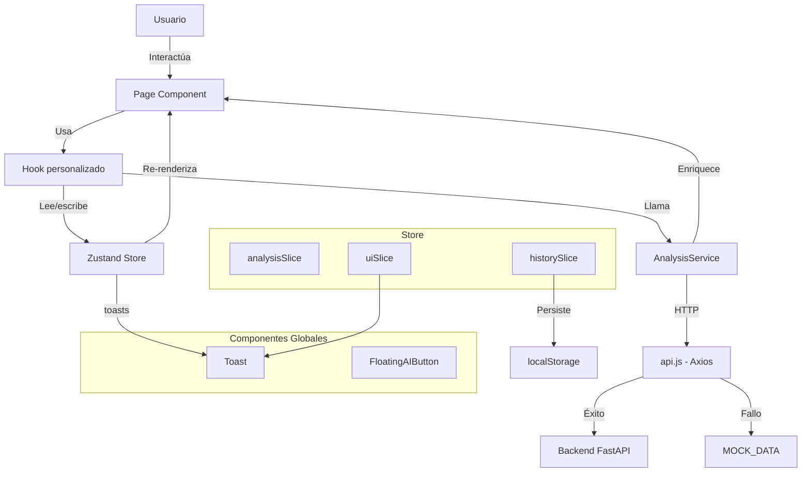

# Arquitectura del Frontend

## 1. Technology Stack

| Componente | Tecnología | Versión | Propósito |
|------------|-----------|---------|-----------|
| Framework UI | React | 19.2.5 | Librería de componentes con renderizado declarativo |
| Bundler | Vite | 8.0 | Dev server con HMR, build optimizado para Cloudflare Pages |
| Routing | React Router DOM | 6.30 | 15 rutas públicas y protegidas |
| Estado global | Zustand | 5.0 | Store con slices: análisis, UI, historial |
| Estilos base | Tailwind CSS | 3.4 | Utility classes con paleta M3 personalizada |
| Mapas | Leaflet + react-leaflet | 1.9 / 5.0 | Mapas interactivos con marcadores y dibujo de polígonos |
| Dibujo mapas | leaflet-draw | 1.0 | Plugin para dibujar zonas en el mapa |
| Animaciones | framer-motion | 12.38 | Animaciones de entrada, dropdowns y transiciones |
| Iconos | lucide-react | 1.14 | Conjunto de iconos principal |
| Peticiones HTTP | axios | 1.16 | Cliente HTTP con timeout e interceptores |
| Despliegue | Por definir | — | Build output en `./dist` |

---

## 2. Estructura del Proyecto

```
src/
├── main.jsx                              # Punto de entrada Vite
├── App.jsx                               # BrowserRouter + 15 rutas + componentes globales
│
├── assets/
│   └── images/
│       ├── logo.png                      # Logo AgroCaribe AI
│       ├── login-investigador.jpg        # Imagen fondo login
│       └── nofoto-Usuario.png            # Avatar por defecto
│
├── shared/                               # Capa transversal
│   ├── layout/
│   │   ├── ResearcherLayout/             # Layout principal autenticado
│   │   │   ├── ResearcherLayout.jsx      # Nav pill fijo + content scroll + auth guard
│   │   │   └── ResearcherLayout.css      # 7473 B — estilos del layout
│   │   ├── AmbientBackground/            # Fondo decorativo animado
│   │   │   ├── AmbientBackground.jsx     # SVG con topo, orbs, partículas, noise
│   │   │   └── AmbientBackground.module.css
│   │   └── FloatingAIButton/             # Botón flotante → AgroAsesor
│   │       └── FloatingAIButton.jsx      # visible solo en /investigador/* excepto /mapas
│   │
│   ├── services/
│   │   ├── api.js                        # Axios client + 5 endpoints + MOCK_DATA completo
│   │   └── analysisService.js            # Capa de negocio: análisis, predicción, ranking
│   │
│   ├── store/
│   │   ├── index.js                      # useAppStore combinado
│   │   ├── analysisSlice.js              # formulario, resultado, loading
│   │   ├── uiSlice.js                    # toasts con auto-dismiss
│   │   └── historySlice.js               # historial persistido en localStorage
│   │
│   ├── styles/
│   │   └── index.css                     # Variables CSS (M3 tokens) + glass classes + animaciones
│   │
│   └── ui/
│       ├── Toast/Toast.jsx + .css        # Sistema de notificaciones global
│       ├── InfoTip/InfoTip.jsx           # Tooltip hover con icono Info
│       └── DataSourcesCard/DataSourcesCard.jsx  # Card de fuentes de datos
│
└── features/                             # 9 módulos de dominio
    ├── analysis/                         # Análisis de cultivos (principal)
    │   ├── pages/                        # AnalisisCultivos, Resultado, ResultadoAvanzado
    │   ├── hooks/                        # useAnalisisCultivos, useResultado, useResultadoAvanzado
    │   └── components/                   # 16 componentes (MapSelector, SoilParameters, etc.)
    │
    ├── auth/                             # Autenticación
    │   └── pages/                        # Acceso, LoginInvestigador
    │
    ├── chat/                             # AgroAsesor (chatbot + fuentes de datos)
    │   ├── pages/                        # AgroAsesor
    │   ├── hooks/                        # useChat
    │   └── components/                   # ChatHeader, ChatMessages, ChatInput, etc.
    │
    ├── dashboard/                        # Dashboard principal
    │   ├── pages/                        # DashboardInvestigador
    │   ├── hooks/                        # useDashboard
    │   └── components/                   # 8 componentes (AIMetricsGrid, WeatherWidget, etc.)
    │
    ├── history/                          # Historial de análisis
    │   ├── pages/                        # Historial
    │   ├── hooks/                        # useHistorial
    │   └── components/                   # HistorialDropdown
    │
    ├── map/                              # Mapa interactivo
    │   ├── pages/                        # Mapa
    │   ├── hooks/                        # useMapZone
    │   └── components/                   # DrawControl, LayerToggle, ZonePanel
    │
    ├── predictions/                      # IA Predictiva
    │   ├── pages/                        # IAPredictiva
    │   ├── hooks/                        # usePredictionSimulator
    │   └── components/                   # SimulatorPanel, GrowthChart, FieldMap, etc.
    │
    ├── reports/                          # Gestión de reportes
    │   ├── pages/                        # GestionReportes
    │   ├── hooks/                        # useTaskManager
    │   └── components/                   # GaugeChart, HydroChart, NdviMiniMap
    │
    └── sensors/                          # Sensores IoT
        ├── pages/                        # SensoresIoT
        ├── hooks/                        # useSensoresIoT
        └── components/                   # NodeList, FarmMap, TelemetryPanel, etc.
```

**Totales:** 99 archivos fuente, ~463 KB de código (excluyendo imágenes).

---

## 3. Routing

### 3.1 Árbol de Rutas

```
<BrowserRouter>
  <Toast />                          ← Global: esquina inferior derecha
  <FloatingAIButton />               ← Global: botón flotante

  <Routes>
    /                                → Acceso              (Selección: Productor / Investigador)
    /investigador/login              → LoginInvestigador   (Credenciales demo)
    /investigador                    → DashboardInvestigador
    /investigador/dashboard          → DashboardInvestigador
    /dashboard                       → DashboardInvestigador
    /investigador/mapas              → AgroAsesor          (Chat + mapa)
    /investigador/mapa               → Mapa                (Mapa satelital full)
    /investigador/historial          → Historial           (Historial de análisis)
    /investigador/analisis           → AnalisisCultivos    (Formulario + mapa)
    /investigador/resultado-avanzado → ResultadoAvanzado
    /investigador/ia                 → IAPredictiva        (Simulador IA)
    /investigador/sensores           → SensoresIoT         (Monitoreo sensores)
    /investigador/reportes           → GestionReportes     (Reportes)
    /resultado                       → Resultado           (Resultado compartido)
    *                                → 404 "Página no encontrada"
  </Routes>
</BrowserRouter>
```

### 3.2 Componentes Globales (fuera del Router)

Renderizados en `App.jsx` por fuera de `<Routes>` para estar disponibles en todas las páginas:

- **`<Toast />`** — lee el array `toasts` del store Zustand (`uiSlice`). Posicionado fixed bottom-right. Auto-dismiss a los 4 segundos con barra de progreso animada.
- **`<FloatingAIButton />`** — navega a `/investigador/mapas`. Solo visible en rutas `/investigador/*` excepto `/investigador/mapas` y `/investigador/login`.

### 3.3 Auth Guard (en ResearcherLayout)

El layout `ResearcherLayout` verifica `sessionStorage.getItem('rol')`. Si no existe, redirige a `/investigador/login`. La sesión se pierde al cerrar la pestaña (sessionStorage).

**Flujo de login:**
1. `Acceso.jsx` en `/` → botón "Soy Investigador" navega a `/investigador/login`
2. `LoginInvestigador.jsx` valida contra credenciales hardcodeadas: `investigador@techcamp.co` / `AgroCaribe2025`
3. Setea `sessionStorage.setItem('rol', 'investigador')` → navega a `/investigador/dashboard`
4. `ResearcherLayout` detecta `rol` en sessionStorage → renderiza contenido

---

## 4. Estado Global (Zustand)

### 4.1 Estructura del Store

```mermaid
graph TD
    A[useAppStore] --> B[analysisSlice]
    A --> C[uiSlice]
    A --> D[historySlice]

    B --> E[formulario: 14 campos]
    B --> F[resultado: object | null]
    B --> G[cargandoAnalisis: bool]
    B --> H[errorAnalisis: string | null]

    C --> I[toasts: array]
    C --> J[agregarToast / eliminarToast]

    D --> K[historial: array]
    D --> L[agregarAlHistorial / limpiarHistorial]
    L --> M[localStorage key: agrocaribe_historial]
```

### 4.2 analysisSlice — Formulario y Resultados

```javascript
// Estado inicial
formulario = {
  departamento: '', municipio: '', lat: 10.5, lng: -74.8,
  tipo_suelo: '', acceso_riego: false, mes_siembra: '',
  area_hectareas: '', ph_suelo: '', textura_suelo: '', materia_organica: '',
}

// Acciones
actualizarFormulario(campos)    // Merge parcial
resetearFormulario()            // Valores iniciales
setResultado(data)              // Guarda resultado del análisis
setCargandoAnalisis(bool)
setErrorAnalisis(error)
resetearResultado()
```

### 4.3 uiSlice — Notificaciones

```javascript
toasts: []  // { id: timestamp, mensaje: string, tipo: 'exito'|'error'|'advertencia'|'info' }
agregarToast(mensaje, tipo = 'info')  // Auto-dismiss 4s
eliminarToast(id)
```

### 4.4 historySlice — Persistencia localStorage

```javascript
historial: []  // Cargado de localStorage('agrocaribe_historial')
agregarAlHistorial(registro)  // Genera ID (C-XXX, S-XXX o P-XXX), timestamp, guarda
limpiarHistorial()

// Migración automática de tipos antiguos:
// 'simple' → 'analisis', 'advanced' → 'suelo'
```

### 4.5 Patrón de uso

```javascript
import useAppStore from '@shared/store';

function MiComponente() {
  const { formulario, actualizarFormulario, resultado } = useAppStore();
  // ...
}
```

---

## 5. API y Servicios

### 5.1 Arquitectura de Capas

```
Page Component → Hook → AnalysisService → api.js (Axios) → Backend
                    ↓                          ↓
                useAppStore              MOCK_DATA (fallback)
```

### 5.2 api.js — Cliente HTTP

```javascript
BASE_URL = import.meta.env.VITE_API_URL || 'http://localhost:8000'
timeout: 15000ms
```

**Endpoints:**

| Función | Método | Ruta | Mock data |
|---------|--------|------|-----------|
| `getMunicipios()` | GET | `/municipalities` | 8 municipios del Caribe |
| `analizarUbicacion(payload)` | POST | `/analyze-location` | 4 cultivos (delay 1.8s simulado) |
| `getClima(lat, lng)` | GET | `/climate` | Temp, precip, humedad, etc. |
| `getIndicadoresSatelite(lat, lng)` | GET | `/satellite-indicators` | NDVI, NDWI, calidad suelo |
| `getHistorial()` | GET | `/history` | 5 entries historial |

**Estrategia de fallback:** Toda llamada tiene try/catch. Si la API no responde, retorna datos de `MOCK_DATA` sin errores visibles. Un interceptor de respuesta monitorea `apiDisponible`.

### 5.3 analysisService.js — Lógica de Negocio

Métodos principales:

| Método | Función |
|--------|---------|
| `performAnalysis(formData)` | Llama a `POST /analyze-location`, enriquece con `structuredRecommendation` |
| `runPrediction(inputs)` | Simulación determinista de modelo ML (rendimiento, probabilidad, riesgo) |
| `getAvailableLocations()` | Proxy a `getMunicipios()` |
| `getClimateData(lat, lng)` | Proxy a `getClima()` |
| `getSatelliteIndicators(lat, lng)` | Proxy a `getIndicadoresSatelite()` |
| `getHistory()` | Proxy a `getHistorial()` |
| `createStructuredAnalysisPayload(raw, formData)` | Construye thought, KPIs (NDVI, humedad, nitrógeno), ranking, nota técnica |

**Heurísticas internas:**
- NDVI < 0.3 → prioriza cultivo de cobertura (Canavalia)
- Estimación de nitrógeno desde materia orgánica + área
- Score clamp entre 70-97
- Ranking top 3 con justificación agronómica templada

---

## 6. Sistema de Diseño

### 6.1 Paleta de Colores (Tailwind + CSS Variables)

Definida en `tailwind.config.js` (50+ tokens) y `src/shared/styles/index.css` (CSS custom properties):

```
primary:           #2D5A27   (verde oscuro)
primary-container: #2d6a4f   (verde medio)
secondary:         #75584d   (marrón)
tertiary:          #386a20   (verde claro)
error:             #ba1a1a   (rojo)
surface:           #F9FAF9   (fondo)
on-surface:        #1A1C1A   (texto)
```

La paleta M3 completa está disponible como variables `--m3-*` en `index.css`.

### 6.2 Tipografía

- **Fuente única:** Manrope (importada vía `@import` en `index.css`)
- **Escala:** `display-lg` (48px), `headline-lg` (32px), `headline-md` (24px), `body-lg` (18px), `body-md` (16px), `label-sm` (12px)

**Nota:** El `index.html` carga fuentes adicionales (Inter, Space Grotesk, Montserrat, Syne, JetBrains Mono) que no se usan. Son candidatas a limpieza.

### 6.3 Glassmorphism (clases globales en `index.css`)

| Clase | Uso |
|-------|-----|
| `.glass-card` | Fondo blanco 70%, blur(12px), radius 2rem, hover lift |
| `.glass-panel` | Mismo efecto sin hover |
| `.glass-card-solid` | Fondo blanco opaco, hover lift |
| `.glass-input` / `.glass-select` | Inputs/selects con estilo glass |
| `.btn-primary-pill` | Botón verde pill con sombra |
| `.btn-ghost-pill` | Botón outline ghost |
| `.btn-gradient-pill` | Botón con gradiente verde |
| `.bento-card` | Card bento-grid estándar |

### 6.4 Enfoques de CSS (3 coexisten)

| Enfoque | Dónde se usa | Ejemplo |
|---------|-------------|---------|
| **Tailwind utility classes** | AnalisisCultivos (modo simple), App.jsx | `className="flex gap-4 lg:col-span-8"` |
| **CSS Modules** | auth/, AmbientBackground, AnalysisForm, MapSelector, AnalysisResults | `import styles from './X.module.css'` |
| **Plain CSS files** | ResearcherLayout, AgroAsesor, Dashboard, Historial, Mapa, etc. | `import './X.css'` |

### 6.5 Animaciones

- **framer-motion**: Dropdowns en ResearcherLayout, entrada de mensajes en chat, cards del dashboard
- **CSS @keyframes**: `dropIn`, `pulse`, `ac-pulse-anim`, `toast-enter`, `toast-countdown`
- **Transiciones**: `0.3s ease` standard en hover de cards y botones

---

## 7. Features por Módulo

### 7.1 Analysis (Análisis de Cultivos) — `src/features/analysis/`

**Rutas:** `/investigador/analisis`, `/investigador/resultado-avanzado`, `/resultado`

El módulo principal. Dos modos:

| Modo | Descripción | Componentes clave |
|------|-------------|-------------------|
| **Simple** | Formulario + mapa + métricas → recomendación de cultivos | `AnalisisCultivos` (bento grid 12 cols), `MapSelector`, `AnalysisForm`, `MetricCardsGrid` |
| **Advanced** | Datos de parcela histórica + parámetros suelo → análisis avanzado | `AnalisisCultivos` (grid 7+5 cols), `ClimateDataCards`, formulario suelo, `AlgorithmHealthCard` |

**Flujo de submit (modo simple):**
1. Usuario completa formulario +
2. Selecciona ubicación en mapa
3. Submit → `useAnalisisCultivos.handleSubmit()`
4. → `AnalysisService.performAnalysis(formulario)`
5. → `POST /analyze-location` (o mock)
6. → Store `setResultado`
7. → `agregarAlHistorial`
8. → Navega a `/resultado`

**16 componentes:** MapSelector, AnalysisForm, AnalysisResults, SoilParameters, RadarChart, HeatMap, RecommendationsList, SimulationEngine, AdvancedResultHeader, MetricCardsGrid, ClimateDataCards, AlgorithmHealthCard, HistorialTab.

### 7.2 Auth (Autenticación) — `src/features/auth/`

**Rutas:** `/`, `/investigador/login`

**Página de acceso (`/`):**
- Dos bento cards: "Soy Productor" (rol=productor → `/investigador/analisis`) y "Soy Investigador" → `/investigador/login`
- CSS Modules con glassmorphism, grid 2 columnas

**Login (`/investigador/login`):**
- Split layout: formulario (55%) + imagen de fondo
- Validación contra credenciales demo
- Show/hide password, simulación de carga (1.2s)
- `sessionStorage.setItem('rol', 'investigador')` → redirect a dashboard

### 7.3 Chat (AgroAsesor) — `src/features/chat/`

**Ruta:** `/investigador/mapas`

**Layout:** 3 columnas (260px | center 480-720px | 280px)

| Panel | Contenido |
|-------|-----------|
| Izquierdo (`DataSources`) | Fuentes conectadas (suelo, satélite, clima), parcelas, sensores IoT |
| Centro | `ChatHeader`, `ChatMessages`, `QuickActions`, `ChatInput` |
| Derecho (`StudioPanel`) | Atajos a reportes, mapa nutrientes, predicción, etc. |

**Chat (hoy 100% mock):**
- 4 respuestas predefinidas: último análisis, historial, recomendar, sensores
- Simula delay de 1.2s con `setTimeout`
- Las respuestas contienen datos hardcodeados (no consultan API)
- Formato: `{ rol: 'ia'|'usuario', texto: string (markdown), hora: string }`

### 7.4 Dashboard — `src/features/dashboard/`

**Rutas:** `/investigador/dashboard`, `/investigador`, `/dashboard`

**Layout:** Bento grid con framer-motion (staggered entry):
1. `DashboardHeader` — título + timestamp + refresh
2. `AIMetricsGrid` — 4 cards: Accuracy (94.2%), Latencia (128ms), Muestras (2,847), Alertas (3)
3. `ModelMetricsTable` — tabla de rendimiento por cultivo (Maíz, Yuca, Frijol, Cacao)
4. `WeatherWidget` — clima en grid 2x2
5. `FieldUpdatesFeed` — feed de actualizaciones de campo
6. `WeeklySummary` — resumen semanal (24 análisis, 7 alertas, 3 reportes)
7. `ModuleShortcuts` — accesos directos a módulos

### 7.5 History (Historial) — `src/features/history/`

**Ruta:** `/investigador/historial`

**Características:**
- Búsqueda por texto
- Filtros por tipo (todos/analisis/suelo) y estado (todos/Exitosa/Pendiente/Error)
- Contadores de estadísticas
- Lista de cards expandibles con vista detalle y eliminar
- `HistorialDropdown` en el navbar (últimos 5, con framer-motion)

### 7.6 Map (Mapa) — `src/features/map/`

**Ruta:** `/investigador/mapa`

**Características:**
- Leaflet con LayerControl: ESRI Satellite / OpenStreetMap
- 3 nodos IoT con marcadores y estado (óptimo/advertencia/alerta)
- Círculo overlay de zona
- `DrawControl` para dibujar polígonos (leaflet-draw)
- `ZonePanel` con métricas de la zona seleccionada

### 7.7 Predictions (IA Predictiva) — `src/features/predictions/`

**Ruta:** `/investigador/ia`

**Rol del modulo:** planificacion estacional. A diferencia de `AnalisisCultivos`,
que diagnostica la aptitud actual de una parcela, `IA Predictiva` reutiliza
coordenadas manuales o del historial para proyectar los proximos 6 meses y
decidir ventana de siembra, cultivo recomendado y riesgo climatico futuro.

**Características:**
- Selector de historial que solo precarga coordenadas y contexto de parcela; la
  proyeccion se ejecuta con `Generar Proyeccion`.
- Persistencia de predicciones generadas como registros `tipo: prediccion` en
  el historial local.
- `SimulatorPanel` — sliders de riego y NPK
- `GrowthChart` — SVG area chart de crecimiento vs estrés (6 meses)
- `FieldMap` — visualización SVG de parcela
- `FeatureChart` — barras horizontales de importancia de factores
- `AIAlertsPanel` — alertas con prioridad alta/media/baja
- La simulación es determinista: mismos inputs → mismos outputs

### 7.8 Reports (Reportes) — `src/features/reports/`

**Ruta:** `/investigador/reportes`

**Características:**
- `GaugeChart` — donut SVG (82% eficiencia)
- `NdviMiniMap` — timeline NDVI (Mar-Ago) con flechas de tendencia
- `HydroChart` — balance hídrico: precipitación vs evapotranspiración
- Task manager — checklist con 3 tareas toggleables + barra de progreso

### 7.9 Sensors (Sensores IoT) — `src/features/sensors/`

**Ruta:** `/investigador/sensores`

**Características:**
- `NodeList` — 6 nodos IoT con estado online/offline
- `FarmMap` — SVG del layout de la finca con indicadores de nodos
- `TelemetryPanel` — telemetría del nodo seleccionado + control de válvula
- `EventLog` — feed de eventos cronológicos
- `RssiBar` y `Spark` — componentes micro SVG

---

## 8. Data Flow Completo



**Flujo típico de análisis:**
1. Usuario llena formulario en `AnalisisCultivos` (modo simple)
2. `useAnalisisCultivos` actualiza `formulario` en store
3. Submit → `AnalysisService.performAnalysis()`
4. `api.js` intenta `POST /analyze-location`
5. Si backend responde → datos reales
6. Si no responde → `MOCK_DATA.recomendaciones` (delay 1.8s)
7. `analysisService.js` construye `structuredRecommendation` (KPIs, ranking, nota técnica)
8. Store `setResultado` + `agregarAlHistorial`
9. Navega a `/resultado`
10. `Resultado.jsx` lee `resultado` del store y renderiza `AnalysisResults`

---

## 9. Convenciones de Código

### 9.1 Imports (path aliases)

```javascript
import ResearcherLayout from '@shared/layout/ResearcherLayout/ResearcherLayout';
import useAppStore from '@shared/store';
import AnalysisService from '@shared/services/analysisService';
import MapSelector from '@features/analysis/components/MapSelector';
```

### 9.2 Estructura de Feature

```
features/<nombre>/
├── pages/             ← Componentes de página (conectados a rutas)
├── hooks/             ← Lógica reutilizable (separación de concerns)
└── components/        ← Componentes de UI (props + callbacks)
```

### 9.3 Patrón de Hook

```javascript
export default function useMiFeature() {
  const storeValue = useAppStore(...);
  const [localState, setLocalState] = useState(...);

  const handleAction = useCallback((...args) => {
    // lógica
  }, [deps]);

  return { storeValue, localState, handleAction };
}
```

### 9.4 Estilos

- **CSS Module** para componentes reutilizables o con estilos complejos
- **Plain CSS** para páginas enteras con estilos específicos
- **Tailwind** para layouts rápidos y spacing

### 9.5 Iconos

Usar exclusivamente `lucide-react`. Excepciones existentes por migrar:
- `ResultadoAvanzado.jsx` usa `<span className="material-symbols-outlined">`
- `GestionReportes.jsx` usa `<span className="material-symbols-outlined">`

---

## 10. Despliegue

### 10.1 Comandos

| Comando | Acción |
|---------|--------|
| `npm run dev` | Dev server en `localhost:5173` |
| `npm run build` | Build → `./dist` |
| `npm run preview` | Preview build local |
| `npm run lint` | ESLint |

### 10.2 Build

```bash
npm run build  # → ./dist
```

### 10.3 Variables de Entorno

```bash
VITE_API_URL=http://localhost:8000  # Backend URL (opcional, default)
```

---

## 11. Dependencias

### Producción

| Paquete | Versión | Tamaño aprox. |
|---------|---------|---------------|
| react + react-dom | ^19.2.5 | 144 KB |
| react-router-dom | ^6.30.3 | 65 KB |
| zustand | ^5.0.12 | 5 KB |
| axios | ^1.16.0 | 15 KB |
| leaflet + react-leaflet | ^1.9 / ^5.0 | 145 KB |
| leaflet-draw | ^1.0.4 | 60 KB |
| lucide-react | ^1.14.0 | 120 KB |
| framer-motion | ^12.38.0 | 145 KB |

### Desarrollo

| Paquete | Versión | Propósito |
|---------|---------|-----------|
| vite | ^8.0 | Bundler + dev server |
| @vitejs/plugin-react | ^6.0 | Fast Refresh + SWC |
| tailwindcss | ^3.4 | Utility CSS |
| eslint | ^9.39 | Linting |
| autoprefixer | ^10.5 | CSS vendor prefixes |
| postcss | ^8.5 | CSS transformations |

---

## 12. Deuda Técnica y Mejoras Potenciales

| Ítem | Prioridad | Descripción |
|------|-----------|-------------|
| Migrar Material Symbols a lucide-react | Media | `ResultadoAvanzado` y `GestionReportes` aún usan `<span class="material-symbols-outlined">` |
| Unificar approach de CSS | Baja | 3 enfoques coexisten (Tailwind, CSS Modules, plain CSS) |
| TypeScript | Baja | Proyecto 100% JSX, migración voluntaria |
| Autenticación real | Media | Hoy es sessionStorage + credenciales hardcodeadas |
| Tests | Alta | No existe suite de pruebas configurada |
| Limpiar fuentes en index.html | Baja | Se cargan 6 fuentes, solo se usa Manrope |

---

## Referencias

- [[2-backend/ARQUITECTURA_BACKEND]] — Arquitectura del backend y endpoints
- [[4-arquitectura/FLUJO_DATOS]] — Mapa de conexion Frontend-Backend completo
- [[4-arquitectura/VISION_SISTEMA]] — Stack tecnologico y flujo de procesamiento
