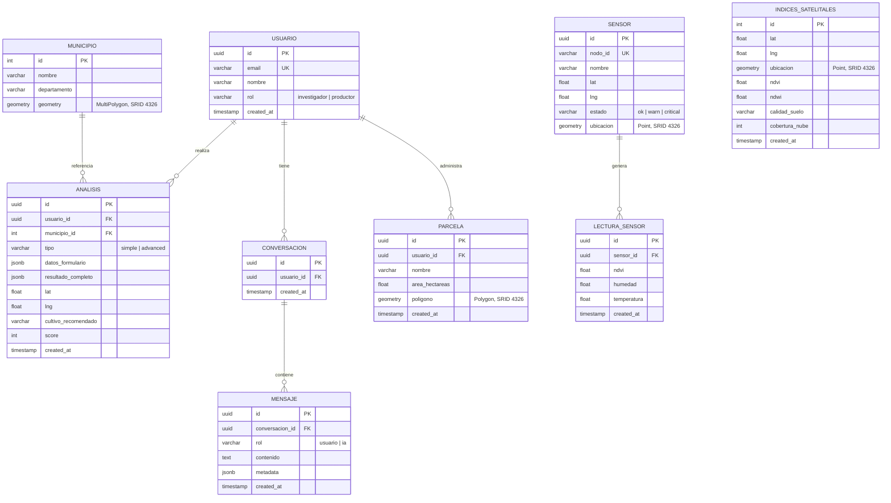

---
titulo: "Arquitectura de Base de Datos"
proyecto: AgroCaribe IA
tags: [base-datos, postgresql, postgis, esquema, supabase]
---

# Arquitectura de Base de Datos

## Esquema Relacional



## PostGIS

Extension geoespacial habilitada. Los municipios usan `MultiPolygon` para permitir consultas "que municipio contiene este punto" via `ST_Contains`.

### Indices espaciales

| Tabla | Columna | Indice |
|-------|---------|--------|
| municipios | geometry | GIST |
| indices_satelitales | ubicacion | GIST |
| sensores | ubicacion | GIST |
| parcelas | poligono | GIST |

### Consultas espaciales clave

**Detectar municipio desde coordenadas (POST /geo/decode):**
```sql
SELECT m.id, m.nombre, m.departamento
FROM municipios m
WHERE ST_Contains(m.geometry, ST_SetSRID(ST_MakePoint(:lng, :lat), 4326))
LIMIT 1;
```

**Buscar NDVI mas cercano (GET /satellite-indicators):**
```sql
SELECT ndvi, ndwi, calidad_suelo, cobertura_nube
FROM indices_satelitales
ORDER BY ubicacion <-> ST_SetSRID(ST_MakePoint(:lng, :lat), 4326)
LIMIT 1;
```

## JSONB

Las tablas `analisis.datos_formulario` y `analisis.resultado_completo` usan JSONB para flexibilidad: cada tipo de analisis (simple/advanced) tiene campos distintos. Esto evita columnas NULL y permite extender el formulario sin migraciones.

## Seed Data Inicial

### Municipios
Los 8 municipios del Caribe colombiano se insertan via seed SQL automatico en Docker (`backend/data/seeds/01_municipios.sql`).

### Sensores IoT (6 nodos)

| Nodo | Ubicacion | Estado |
|------|-----------|:------:|
| SN-MTR-001 | Monteria Centro | ✅ ok |
| SN-BAQ-002 | Barranquilla Puerto | ✅ ok |
| SN-SM-003 | Santa Marta Cerro | ⚠️ warn |
| SN-VDP-004 | Valledupar Valle | 🔴 critical |
| SN-CTG-005 | Cartagena Bocagrande | ✅ ok |
| SN-SNJ-006 | Sincelejo Norte | ⚠️ warn |

Cada sensor tiene 21 lecturas historicas (3 diarias × 7 dias) en `lecturas_sensores`.

### Parcelas de prueba

| Nombre | Area | Ubicacion |
|--------|:----:|-----------|
| El Trebol | 12.5 ha | Monteria |
| La Esperanza | 8.3 ha | Barranquilla |
| El Porvenir | 20.0 ha | Cartagena |

### Analisis historicos
5 registros de prueba con cultivos (Maiz, Yuca, Platano, Algodon) y tipos (analisis, simple, advanced).

### Datos satelitales NDVI
**2,517,987 puntos** NDVI importados desde CSVs procesados en QGIS (7 regiones del Caribe).

## Migraciones (Alembic)

Las migraciones de Alembic estan en `backend/data/migrations/`. Para ejecutar:

```bash
docker compose exec backend alembic upgrade head
```

`env.py` lee `DATABASE_URL` del entorno (apunta a `db:5432` dentro de Docker).

## RLS (Row Level Security)

> **Nota:** La BD local no tiene RLS activado. Las politicas existen solo en Supabase.

Actualmente todas las politicas RLS permiten SELECT sin restricciones (`USING (true)`) para que el backend pueda leer datos sin autenticacion. Esto es para desarrollo/demo. En produccion, las politicas originales deben restaurarse:

```sql
-- Originales (guardadas en supabase/migrations/)
analisis: FOR SELECT USING (usuario_id = auth.uid())
usuarios: FOR SELECT USING (id = auth.uid())
municipios: FOR SELECT USING (true)
indices_satelitales: FOR SELECT USING (true)
sensores: FOR SELECT USING (true)
lecturas_sensores: FOR SELECT USING (true)
conversaciones: FOR SELECT USING (usuario_id = auth.uid())
mensajes: via conversacion_id IN (SELECT id FROM conversaciones WHERE usuario_id = auth.uid())
```

## Conexion (Local Docker)

| Propiedad | Valor |
|-----------|-------|
| Host | `localhost` (o `db` dentro de Docker) |
| Puerto | 5432 |
| Base de datos | agrocaribe |
| Usuario | agrocaribe |
| Password | agrocaribe_secret |
| Volumen | `pgdata` (Docker volume persistente) |

---

## Referencias

- [[2-backend/ARQUITECTURA_BACKEND]] — Modelos SQLAlchemy + ERD
- [[4-arquitectura/VISION_SISTEMA]] — Flujo de datos en el sistema
- [[4-arquitectura/FLUJO_DATOS]] — Mapeo de endpoints a tablas
- [[4-arquitectura/DESPLIEGUE]] — Conexion Docker-Supabase y pooler
- [[5-implementacion/CHAT_2025-05-19]] — Contexto de migracion a DB local

