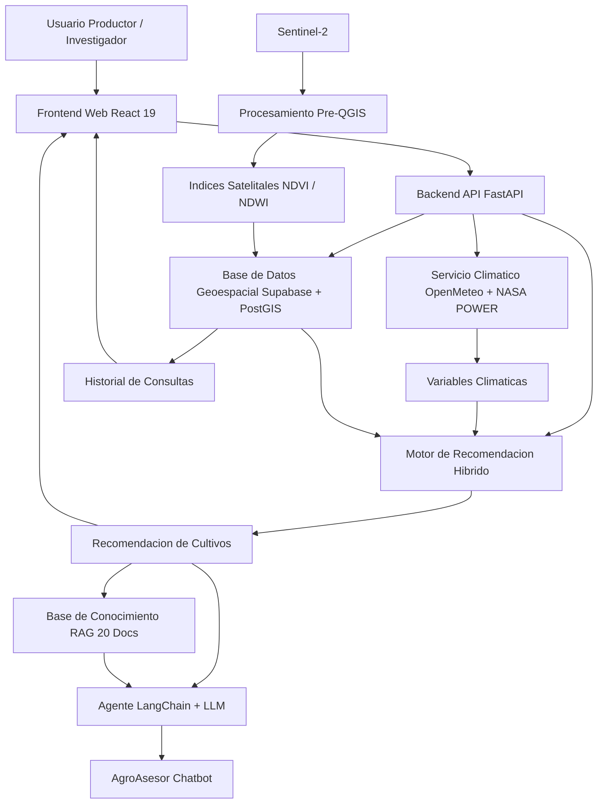

# Vision General del Sistema

## Diagrama de Bloques



## Stack Tecnologico

| Capa | Tecnologia | Version |
|------|-----------|---------|
| Frontend | React + Vite + Tailwind + Zustand | 19 / 8 / 3.4 / 5 |
| Backend | FastAPI + SQLAlchemy + asyncpg | 0.115 / 2.0 / 0.30 |
| Base de datos | PostgreSQL + PostGIS | 17 / 3.4 |
| Contenedores | Docker | 27+ |
| ML | scikit-learn (Random Forest) | 1.6 |
| Agente IA | LangChain + LangGraph | 0.3 |
| Datos satelitales | Sentinel-2 (ESA) | — |
| Datos climaticos | NASA POWER + OpenMeteo | — |

## Flujo de Procesamiento

```
Usuario selecciona parcela en mapa
    ↓
Frontend envia POST /analyze-location con coordenadas + datos de suelo
    ↓
Backend:
    1. Busca municipio por coordenadas (PostGIS ST_Contains)
    2. Consulta OpenMeteo (temperatura, humedad, precipitacion)
    3. Busca NDVI mas cercano en indices_satelitales (ST_Distance)
    4. Ejecuta CropClassifier (reglas agronomicas + scoring ponderado)
    5. Si hay datos de entrenamiento → Random Forest
    6. Guarda analisis completo en DB (JSONB)
    7. Retorna JSON con clima, satelite, recomendaciones
    ↓
Frontend muestra resultados en Reporte de Analisis
    ↓
Usuario puede:
    - Ver detalle por factor (temp, hum, pH, NDVI...)
    - Comparar cultivos
    - Exportar a PDF
    - Preguntar al AgroAsesor sobre los resultados
```

## 19 Endpoints

| Metodo | Ruta | Descripcion |
|--------|------|-------------|
| GET | `/health` | Health check |
| GET | `/municipalities` | Lista de municipios con PostGIS |
| POST | `/analyze-location` | Analisis completo de cultivos |
| GET | `/climate` | Clima actual (OpenMeteo) |
| GET | `/satellite-indicators` | NDVI/NDWI mas cercano |
| GET | `/history` | Historial con JOIN municipios |
| POST | `/auth/login` | Autenticacion Supabase |
| POST | `/chat` | AgroAsesor LangChain + RAG |
| GET | `/sensors` | Sensores IoT con ultima lectura |
| GET | `/sensors/{id}/readings` | Lecturas historicas |
| POST | `/sensors/readings` | Registrar lectura |
| POST | `/geo/decode` | Detectar ubicacion (ST_Contains) |
| POST | `/predict` | Proyeccion 6 meses (NASA POWER) |
| GET | `/reports/alerts` | Alertas del sistema |
| POST | `/reports/compare` | Comparar analisis |
| POST | `/reports/export` | Exportar reporte PDF |
| GET | `/dashboard/summary` | Resumen del dashboard |

## Info del proyecto

- **Proyecto:** TechCamp — AgroCaribe IA
- **Supabase Ref:** `hpmjbgqjwopxlgurczna`
- **Backend Supabase:** `postgres.hpmjbgqjwopxlgurczna` via pooler `aws-1-us-west-1.pooler.supabase.com:6543`

---

## Referencias

- [[4-arquitectura/MODULO_CLIMA]] — Clima: NASA POWER + OpenMeteo
- [[4-arquitectura/MODULO_SATELITAL]] — Satelital: QGIS + Sentinel-2 + NDVI
- [[4-arquitectura/MODULO_RECOMENDACION]] — Motor hibrido de recomendacion
- [[4-arquitectura/ARQUITECTURA_DB]] — Base de datos: esquema, PostGIS, RLS
- [[4-arquitectura/FLUJO_DATOS]] — Flujo detallado Frontend-Backend
- [[4-arquitectura/DESPLIEGUE]] — Docker + Vercel deploy
- [[2-backend/ARQUITECTURA_BACKEND]] — Arquitectura backend y 19 endpoints
