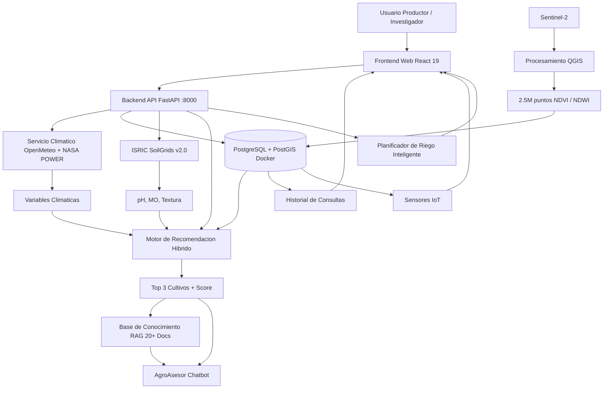

# Vision General del Sistema

## Diagrama de Bloques



## Stack Tecnologico

| Capa | Tecnologia | Version |
|------|-----------|---------|
| Frontend | React + Vite + Tailwind + Zustand | 19 / 8 / 3.4 / 5 |
| Backend | FastAPI + SQLAlchemy + asyncpg | 0.115+ / 2.0+ / 0.30+ |
| Base de datos | PostgreSQL + PostGIS (Docker local) | 17 / 3.4 |
| Contenedores | Docker + Docker Compose | 27+ / 2.30+ |
| ML | scikit-learn RF + LSTM | 1.6+ |
| Agente IA | LangChain + LangGraph + RAG TF-IDF + Ollama | 0.3+ |
| Datos satelitales | Sentinel-2 (ESA) via QGIS | — |
| Datos climaticos | NASA POWER + OpenMeteo | — |
| Datos de suelo | ISRIC SoilGrids v2.0 | REST API |
| Mapas | Leaflet + react-leaflet + leaflet-draw | 1.9 / 5.0 / 1.0 |

## Flujo de Procesamiento

```
Usuario selecciona parcela en el mapa (clic o dibujo)
    ↓
GET /soil/data?lat=X&lng=Y → ISRIC SoilGrids → pH, MO, textura (autocompleta)
    ↓
Usuario ajusta parametros y hace submit
    ↓
POST /analyze-location con coordenadas + datos de suelo
    ↓
Backend:
1. POST /geo/decode → PostGIS ST_Contains → municipio
2. climate_service.get_climate_data() → OpenMeteo
3. satellite_service.get_satellite_data() → Nearest NDVI (ST_Distance)
4. recommendation.generate_recommendations()
   → CropClassifier heuristico + RF inference (con fallback)
5. Guarda analisis en DB
6. Retorna JSON: clima, satelite, top 3 cultivos
    ↓
Frontend muestra resultados en /resultado (AnalysisResults)
    ↓
Usuario puede:
  - Ver detalle por factor
  - Comparar cultivos
  - Exportar reporte
  - Preguntar al AgroAsesor
  - Ir a IA Predictiva para proyeccion de 6 meses
```

## 25+ Endpoints

| Metodo | Ruta | Descripcion |
|--------|------|-------------|
| GET | `/health` | Health check |
| GET | `/municipalities` | Lista de municipios con PostGIS |
| POST | `/analyze-location` | Analisis completo de cultivos |
| GET | `/climate` | Clima actual (OpenMeteo) |
| GET | `/satellite-indicators` | NDVI/NDWI mas cercano |
| GET | `/history` | Historial con JOIN municipios |
| DELETE | `/history/{id}` | Eliminar entrada del historial |
| GET | `/analysis/{id}` | Detalle de analisis por ID |
| POST | `/auth/login` | Autenticacion Supabase |
| POST | `/chat` | AgroAsesor LangChain + RAG + Ollama |
| GET | `/sensors` | Sensores IoT con ultima lectura |
| GET | `/sensors/{id}/readings` | Lecturas historicas |
| POST | `/sensors/readings` | Registrar lectura |
| POST | `/geo/decode` | Detectar ubicacion (ST_Contains) |
| POST | `/predict` | Proyeccion 6 meses (NASA POWER) |
| POST | `/predict/optimal-day` | Ventana optima de siembra |
| POST | `/predict/scenario` | Prediccion por escenario |
| GET | `/reports/alerts` | Alertas del sistema |
| POST | `/reports/compare` | Comparar analisis |
| POST | `/reports/export` | Exportar reporte PDF |
| GET | `/dashboard/summary` | Resumen del dashboard |
| GET | `/soil/data` | Datos de suelo (ISRIC SoilGrids) |
| POST | `/irrigation-plans` | Generar plan de riego |
| GET | `/irrigation-plans/{plan_id}` | Obtener plan de riego |
| GET | `/irrigation-plans/thresholds` | Umbrales de riego por cultivo |

## Info del proyecto

- **Proyecto:** TechCamp — AgroCaribe IA
- **Supabase Ref:** `hpmjbgqjwopxlgurczna` (solo Auth)
- **DB:** PostgreSQL local via Docker (PostGIS 16-3.4)
- **Backend:** FastAPI en `localhost:8000`

---

## Referencias

- [[4-arquitectura/MODULO_CLIMA]] — Clima: NASA POWER + OpenMeteo
- [[4-arquitectura/MODULO_SATELITAL]] — Satelital: QGIS + Sentinel-2 + NDVI
- [[4-arquitectura/MODULO_RECOMENDACION]] — Motor hibrido de recomendacion
- [[4-arquitectura/MODULO_SUELO_SOILGRIDS]] — Datos de suelo automaticos
- [[4-arquitectura/ARQUITECTURA_DB]] — Base de datos: esquema, PostGIS
- [[4-arquitectura/FLUJO_DATOS]] — Flujo detallado Frontend-Backend
- [[4-arquitectura/DESPLIEGUE]] — Docker + Vercel deploy
- [[2-backend/ARQUITECTURA_BACKEND]] — Arquitectura backend y endpoints
