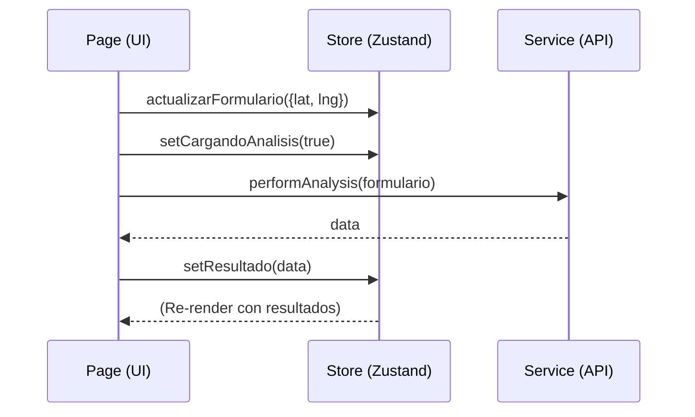

# 🧠 Gestión de Estado (Context)

El proyecto utiliza **Zustand** como solución para el estado global, centralizado en `src/context/useAppStore.js`. Se prefiere Zustand sobre Context API por su simplicidad, rendimiento y facilidad para depurar.

## 📦 El Almacén (Store)

### 📄 Estado (`state`)

| Propiedad | Tipo | Descripción |
| :--- | :--- | :--- |
| `formulario` | Object | Datos actuales del formulario de consulta (ubicación, tipo de suelo, etc). |
| `resultado` | Object | Datos devueltos por el motor de análisis (clima, indicadores, recomendaciones). |
| `cargandoAnalisis` | Boolean | Indicador de carga activo durante la petición al backend. |
| `apiConectada` | Boolean | Estado de salud de la conexión con el servidor FastAPI. |
| `toasts` | Array | Lista de notificaciones activas para mostrar en pantalla. |

### 🛠️ Acciones (`actions`)

- `actualizarFormulario(campos)`: Mezcla los nuevos campos con el estado actual del formulario.
- `setResultado(data)`: Guarda los resultados y limpia errores previos.
- `agregarToast(mensaje, tipo)`: Añade una notificación que desaparece automáticamente tras 4 segundos.
- `resetearFormulario()`: Vuelve los valores del formulario a su estado inicial.

## 🔄 Flujo de Datos

---

> [!NOTE]
> Para usar el estado en un componente:
> `const { formulario, actualizarFormulario } = useAppStore();`

---

[[INDEX|⬅️ Volver al Índice]]
