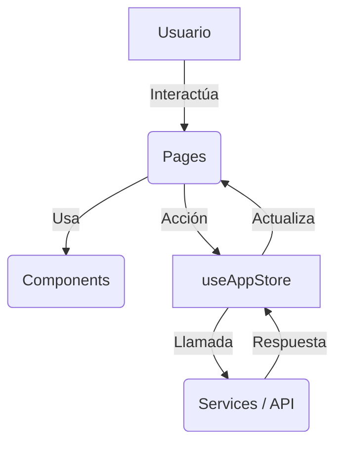

# 🏗️ Arquitectura Frontend

Esta sección describe cómo está organizado el frontend de **AgroCaribe AI** y cómo interactúan sus diferentes capas.

## 🛰️ Flujo General de la Aplicación

La aplicación sigue un flujo unidireccional de datos apoyado por un estado global centralizado.

## 📂 Responsabilidades de Capas

### 1. [[PAGES]]
Son los contenedores de nivel superior. Se encargan de:
- Definir el layout de la vista.
- Suscribirse al estado necesario de `useAppStore`.
- Orquestar la lógica específica de la página.

### 2. [[COMPONENTS]]
Bloques de construcción reutilizables y atómicos. Se encargan de:
- Representar la interfaz visual (UI).
- Recibir datos vía `props`.
- Emitir eventos hacia las páginas.

### 3. [[CONTEXT]] (Zustand)
El "cerebro" de la aplicación.
- Mantiene el estado del formulario de consulta.
- Almacena los resultados del análisis.
- Gestiona notificaciones (Toasts).

### 4. [[SERVICES]]
Capa de abstracción para la comunicación externa.
- `api.js`: Configuración de Axios e interceptores.
- `analysisService.js`: Lógica de negocio pura (cálculos, validaciones, mapeo de datos).

---

## 🎨 Sistema de Diseño
El proyecto utiliza un sistema de diseño propio basado en variables CSS (`index.css`) con una estética **Premium Organic-Lab**:
- **Colores**: Verdes profundos, acentos dorados y fondos limpios (Glassmorphism).
- **Tipografía**: Fuentes modernas configuradas globalmente.
- **Animaciones**: Micro-interacciones suaves para mejorar la experiencia de usuario.

---

[[INDEX|⬅️ Volver al Índice]]
