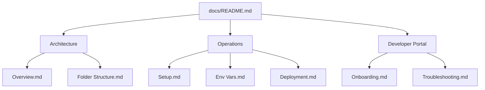

# 🌿 AgroCaribe AI - Technical Documentation

Welcome to the official technical documentation for **AgroCaribe AI**, a high-fidelity platform for agricultural analysis and simulation in the Colombian Caribbean.

## 📌 Quick Links

*   [🏗️ Architecture Overview](architecture/overview.md)
*   [📁 Folder Structure](architecture/folder-structure.md)
*   [🎨 Frontend Guide](frontend/guide.md)
*   [⚙️ Backend Guide](backend/guide.md)
*   [🔌 API Documentation](api/endpoints.md)
*   [💾 Database & Data Models](database/model.md)
*   [🚀 Setup & Installation](operations/setup.md)
*   [🔑 Environment Variables](operations/env-vars.md)
*   [🚢 Deployment Guide](operations/deployment.md)
*   [🧑‍💻 Developer Onboarding](developer/onboarding.md)
*   [🛠️ Troubleshooting](developer/troubleshooting.md)

---

## 🚀 Project Vision
AgroCaribe AI combines satellite imagery, climate data, and advanced agronomic models to provide precise recommendations for crops like Maize, Cassava, Beans, and Yam. It features a premium design system ("Organic Lab") focused on professional investigators and large-scale agricultural planning.

## 📊 Documentation Map

> [!NOTE]
> This documentation is Obsidian-friendly and supports Mermaid diagrams and GitHub-flavored markdown.
