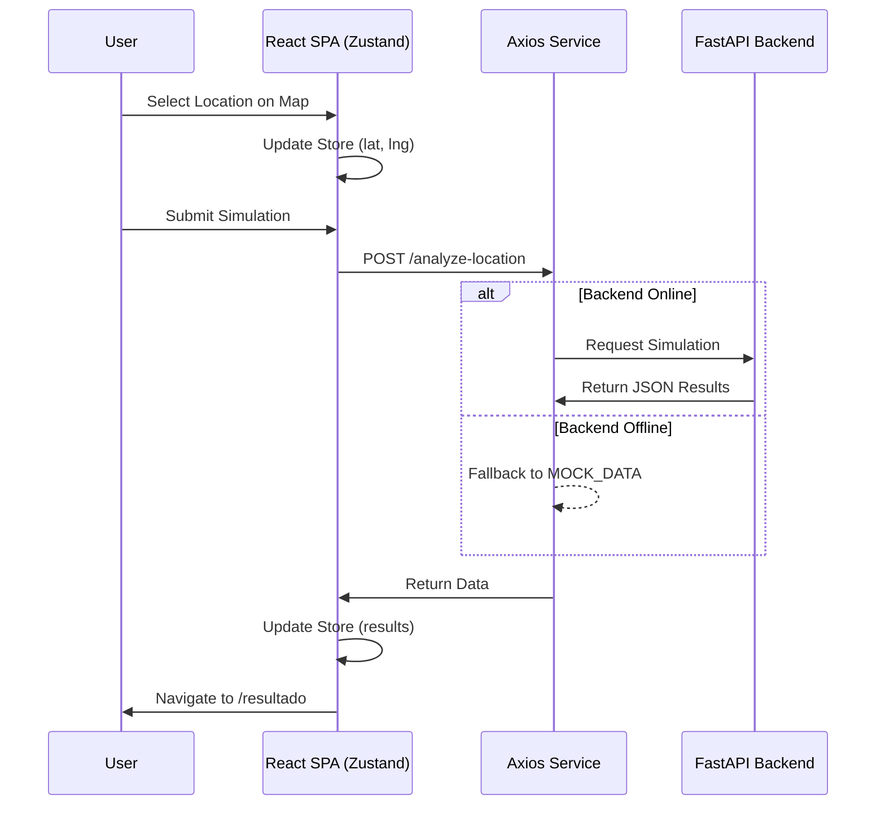

# 🏗️ Architecture Overview

AgroCaribe AI is designed as a modern **React 19 SPA** (Single Page Application) with a decoupled **FastAPI** backend. A key feature of the architecture is its **Resilience Strategy**, allowing the frontend to function fully even when the backend is unreachable by using high-fidelity mock data.

## 🧱 Component Stack

| Layer | Technology | Purpose |
| :--- | :--- | :--- |
| **Frontend** | React 19 + Vite 8 | UI Layer & Build System |
| **State Management** | Zustand | Global application state (form, results, auth) |
| **Routing** | React Router Dom v6 | Navigation and route protection |
| **Maps** | Leaflet + React-Leaflet | Geographic visualization & coordinate selection |
| **API Client** | Axios | Communication with FastAPI backend |
| **Styling** | Vanilla CSS + Modules | Premium "Organic Lab" design system |
| **Backend** | FastAPI (Python) | Heavy data processing & AI simulations |

## 🔄 Data Flow Diagram

## 🛡️ Resilience & Fallback
The `src/services/api.js` client contains a robust interceptor logic. If any request to `VITE_API_URL` fails or times out, the system automatically catches the error and returns a predefined `MOCK_DATA` object. This ensures:
1.  **Zero-Downtime Demos**: The app always works for presentations.
2.  **Disconnected Development**: Frontend developers can work without a local backend.

## 🔐 State Management (Zustand)
The application uses a single store located at `src/context/useAppStore.js`. This store manages:
*   **Form State**: Currently selected municipality and coordinates.
*   **Analysis Results**: Data returned from the simulation.
*   **UI State**: Toasts, loading indicators, and API status.
