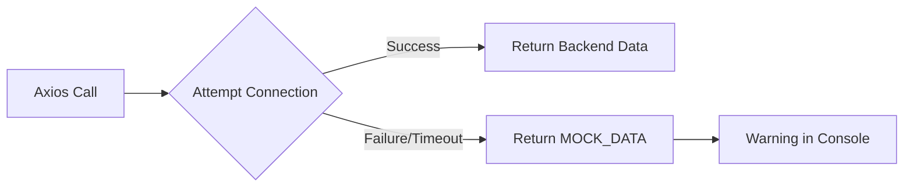

# ⚙️ Backend Guide — AgroCaribe AI

The AgroCaribe AI frontend is designed to work with a **FastAPI** backend, but it includes a "Shadow Backend" (Mock System) for standalone operation.

## 🐍 Backend Technology (Expected)
The backend should be implemented using **Python 3.10+** and **FastAPI**.
*   **Host**: `http://localhost:8000` (Default)
*   **CORS**: Must allow requests from the frontend origin (usually `http://localhost:5173`).

## 🚀 Recommended Resources for Development
Para empezar el desarrollo del backend, consulta los siguientes documentos estratégicos:

1.  **[Backend Roadmap](./roadmap.md)**: Guía paso a paso sobre cómo estructurar el proyecto, el stack y las fases de desarrollo.
2.  **[Database Schema](../database/schema.md)**: Diseño detallado de las tablas y el uso de PostGIS para datos geográficos.
3.  **[API Specification](../api/endpoints.md)**: Contrato de comunicación entre el frontend y el backend.

## 🧪 Simulation Engine
The backend's primary role is to run the **Agro-Simulation Engine**. This involves:
1.  **Coordinate Lookup**: Mapping `lat/lng` to environmental data.
2.  **Climate Fetching**: Retrieving temperature, humidity, and precipitation.
3.  **Satellite Analysis**: Processing NDVI/NDWI indicators (expected via external APIs like Sentinel Hub).
4.  **Crop Matching**: Applying fuzzy logic or ML models to calculate scores for specific crops.

## 🔌 Mock Fallback System
The frontend service `src/services/api.js` acts as a safety net.

### Why use Mocks?
*   **Resilience**: The app doesn't break if the server crashes.
*   **Demos**: You can run the app from a USB drive or a static host for a quick demo.
*   **Frontend Velocity**: UI work can continue even if the backend logic isn't finished.

---

[🏠 Back to Home](../README.md)
