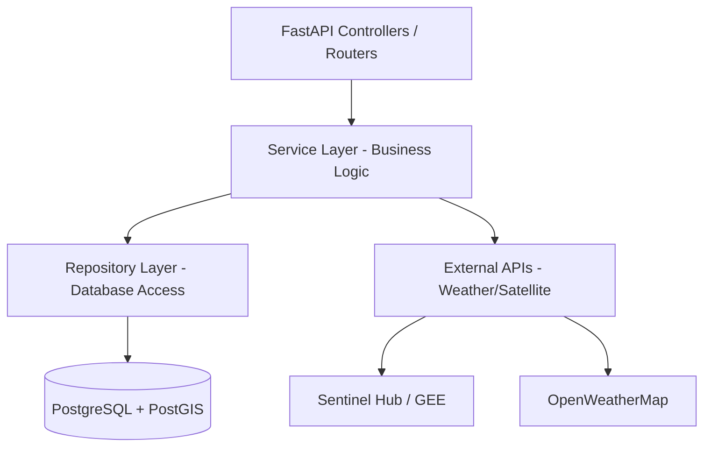

# 🗺️ Roadmap de Implementación Backend — AgroCaribe AI

Este documento detalla la estrategia y los pasos técnicos para construir el backend de AgroCaribe AI utilizando **FastAPI**.

## 1. Arquitectura Propuesta

Se recomienda una arquitectura de **Capas (Layered Architecture)** para mantener la lógica de simulación separada de los controladores de API.



## 2. Stack Tecnológico Recomendado

| Componente | Tecnología | Razón |
| :--- | :--- | :--- |
| **Lenguaje** | Python 3.11+ | Ecosistema robusto para ciencia de datos y agricultura. |
| **Framework Web** | FastAPI | Alto rendimiento (asyncio), tipado automático y documentación Swagger. |
| **Base de Datos** | PostgreSQL + PostGIS | Imprescindible para manejar coordenadas geográficas y polígonos. |
| **ORM** | SQLModel (o SQLAlchemy) | Combina la validación de Pydantic con la persistencia de datos. |
| **Migraciones** | Alembic | Control de versiones para el esquema de la base de datos. |
| **Autenticación** | OAuth2 + JWT | Estándar seguro para el acceso de investigadores. |
| **Tareas de Fondo** | Celery + Redis | Para procesos pesados de análisis satelital que tarden > 5s. |

## 3. Fase 1: Configuración y Estructura Base

1.  **Entorno Virtual**: `python -m venv venv`
2.  **Estructura de Carpetas**:
    ```text
    backend/
    ├── app/
    │   ├── main.py          # Punto de entrada
    │   ├── api/             # Routers (v1)
    │   ├── core/            # Configuración, seguridad
    │   ├── models/          # Modelos de DB (SQLModel)
    │   ├── schemas/         # Esquemas de Pydantic
    │   ├── services/        # Lógica de negocio (simulación)
    │   └── db/              # Sesión de DB y migraciones
    ├── requirements.txt
    └── .env
    ```

## 4. Fase 2: Modelado de Datos (Base de Datos)

### Tablas Principales
*   **Usuarios (Investigadores)**: id, email, hashed_password, rol.
*   **Municipios**: id, nombre, departamento, geom (PostGIS geometry).
*   **Consultas**: id, user_id, lat, lng, fecha, resultado_json.
*   **Cultivos**: id, nombre, parametros_ideales (pH, temp_min, temp_max, etc.).

> [!TIP]
> Usa PostGIS para validar si una coordenada (lat/lng) realmente cae dentro de la región del Caribe colombiano usando la función `ST_Contains`.

## 5. Fase 3: Integración de Datos Externos

Para que `POST /analyze-location` funcione, el backend debe:
1.  **Clima**: Consultar `OpenWeatherMap Historical API` o `NASA POWER`.
2.  **Satelital**: Integrar `Sentinel Hub` para obtener el NDVI actual de la parcela.
3.  **Lógica de Scoring**:
    ```python
    def calculate_crop_score(env_data, crop_requirements):
        # Lógica de matching (puedes empezar con una matriz de pesos simple
        # y luego evolucionar a un modelo de Random Forest/XGBoost).
        pass
    ```

## 6. Fase 4: Seguridad y Auth

Implementar los endpoints de `/auth/login` para que el portal de investigadores pueda obtener un token.
*   Usa `passlib[argon2]` para el hashing de contraseñas.
*   Protege el endpoint `GET /history` con una dependencia de FastAPI: `current_user: User = Depends(get_current_active_user)`.

## 7. Recomendaciones de Implementación (Tips Pro)

1.  **Pydantic para todo**: Define esquemas estrictos para las peticiones y respuestas. Esto generará la documentación Swagger (`/docs`) automáticamente, lo que facilitará el trabajo del frontend.
2.  **Manejo de Errores**: Crea un `ErrorHandler` global que devuelva JSON estructurado al frontend para que los Toasts se muestren correctamente.
3.  **Cache**: Usa `Redis` para cachear resultados de clima por coordenadas. El clima no cambia drásticamente cada hora, ahorra llamadas a APIs externas costosas.
4.  **CORS**: Asegúrate de configurar `CORSMiddleware` para permitir el origen de Vite (`http://localhost:5173`).

---

[🏠 Volver a Documentación](../README.md)
